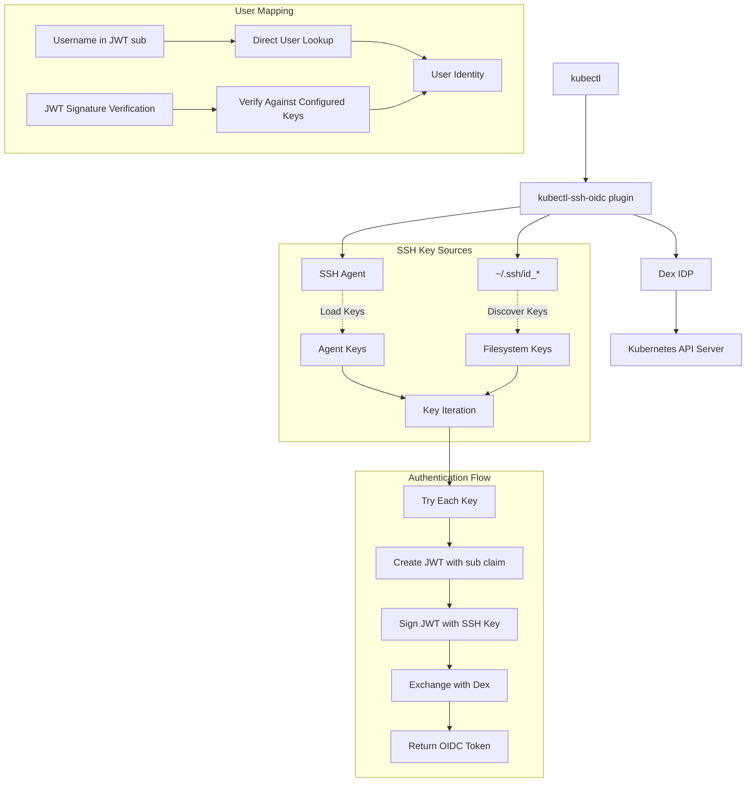

# kubectl-ssh-oidc Architecture

This document provides detailed technical documentation of the kubectl-ssh-oidc authentication system, including the SSH agent signing flow, OAuth2 Token Exchange, and the interaction between the kubectl plugin and Dex SSH connector.

## 🏗️ System Architecture



## 🔐 SSH Key Authentication Flow

### Overview

The plugin supports both SSH agent and filesystem keys, following standard SSH client behavior. It tries each available key in sequence until authentication succeeds. The JWT contains only standard claims (sub, aud, iss, exp, iat, nbf, jti) with no SSH key material - all key verification is performed by Dex using administrator-configured keys.

## TokenIdentityConnector Pattern

### Non-Web OAuth2 Token Exchange Architecture

The Dex SSH connector implements the `TokenIdentityConnector` interface, using OAuth2 Token Exchange (RFC 8693) where **Dex validates SSH-signed JWTs from the kubectl plugin**. The SSH connector is currently available in [github.com/nikogura/dex](https://github.com/nikogura/dex) and will be presented to the upstream Dex project for integration.

```
┌─────────────────┐    ┌──────────────────┐    ┌─────────────┐
│ kubectl plugin  │───▶│ Dex SSH Connector│───▶│    Dex      │
│ (creates JWT)   │    │ (validates JWT)  │    │ (issues     │
│                 │    │                  │    │  OIDC tokens)│
└─────────────────┘    └──────────────────┘    └─────────────┘
  OAuth2 Client           Token Validator       OIDC Server
```

### Components:

- **kubectl plugin**: Creates SSH-signed JWTs and performs OAuth2 Token Exchange
- **Dex SSH connector**: Validates SSH signatures and authorizes users
- **Dex OIDC server**: Issues standard OIDC ID tokens for Kubernetes

### Authentication Method Separation

Dex delegates identity determination to the connector through `TokenIdentity()`:

```go
func (c *SSHConnector) TokenIdentity(ctx context.Context, subjectTokenType, subjectToken string) (connector.Identity, error) {
    // 1. Parse JWT to extract claimed username (UNTRUSTED until verification)
    // 2. Look up user and their authorized public keys
    // 3. Try cryptographic verification against all authorized public keys
    // 4. Return identity from administrative configuration (TRUSTED)
    // 5. Return error if no configured key can verify the JWT
}
```

**Security Model:**
- Dex SSH connector performs all cryptographic validation
- Dex trusts the identity determination if validation succeeds
- Dex applies its own policies (scopes, clients, token generation)

### Comparison with Web Flows

**Traditional Web Connectors:**
- User → Browser → OAuth Provider → Dex
- Interactive, redirect-based
- Requires web interface

**SSH TokenIdentityConnector:**
- Client → SSH-signed JWT → Dex
- Non-interactive, cryptographic
- No web interface required

Both patterns serve different use cases within Dex's pluggable connector architecture.

### Detailed Flow

#### 1. ExecCredential API Integration
**File:** `main.go:14-26`

```go
func main() {
    // Check if we're being called as an ExecCredential plugin
    execInfo := os.Getenv("KUBERNETES_EXEC_INFO")
    if execInfo != "" {
        // Parse the ExecCredential input
        var execCredential clientauthv1.ExecCredential
        err := json.Unmarshal([]byte(execInfo), &execCredential)
        if err != nil {
            fmt.Fprintf(os.Stderr, "Failed to parse KUBERNETES_EXEC_INFO: %v\n", err)
            os.Exit(1)
        }
        
        // We're being called by kubectl as a credential provider
        // The config should still come from environment variables set in kubeconfig
    }
}
```

**Key Points:**
- Implements proper kubectl ExecCredential API by checking `KUBERNETES_EXEC_INFO`
- Ensures kubectl recognizes and calls the plugin as a credential provider
- Maintains backward compatibility with direct invocation

#### 2. UnifiedSSHClient Setup
**File:** `pkg/kubectl/kubectl.go:98-150`

```go
func NewUnifiedSSHClient(config *Config) (*UnifiedSSHClient, error) {
    client := &UnifiedSSHClient{
        config: config,
    }
    
    // Initialize SSH agent if requested
    if config.UseAgent {
        if authSock := os.Getenv("SSH_AUTH_SOCK"); authSock != "" {
            conn, err := net.Dial("unix", authSock)
            if err == nil {
                client.agent = agent.NewClient(conn)
            }
        }
    }
    
    return client, nil
}
```

**Key Points:**
- Unified client supporting both SSH agent and filesystem keys
- Configurable via `SSH_USE_AGENT` environment variable (default: true)
- Gracefully handles missing SSH agent
- Supports custom key paths via `SSH_KEY_PATHS`

#### 2. SSH Key Discovery and Iteration
**File:** `pkg/kubectl/kubectl.go:203-245` and `296-365`

```go
func (c *UnifiedSSHClient) GetAllKeys() ([]SSHKey, error) {
    var allKeys []SSHKey
    
    // Get keys from SSH agent if enabled
    if c.config.UseAgent && c.agent != nil {
        agentKeys, err := c.agent.List()
        if err == nil {
            for _, agentKey := range agentKeys {
                allKeys = append(allKeys, SSHKey{
                    Source:     "agent",
                    AgentKey:   agentKey,
                })
            }
        }
    }
    
    // Get keys from filesystem
    fsKeys, err := c.getFilesystemKeys()
    if err == nil {
        allKeys = append(allKeys, fsKeys...)
    }
    
    return allKeys, nil
}

// Multi-key authentication with iteration
func CreateSSHSignedJWT(config *Config) (string, error) {
    client, err := NewUnifiedSSHClient(config)
    if err != nil {
        return "", fmt.Errorf("failed to create SSH client: %w", err)
    }
    
    keys, err := client.GetAllKeys()
    if err != nil {
        return "", fmt.Errorf("failed to get SSH keys: %w", err)
    }
    
    // Try each key in sequence (standard SSH behavior)
    var keyErrors []KeyAuthError
    for i, sshKey := range keys {
        signedJWT, err := tryKeyAuthentication(client, sshKey, config, i+1)
        if err == nil {
            return signedJWT, nil // Success!
        }
        keyErrors = append(keyErrors, KeyAuthError{
            KeyIndex: i + 1,
            Source:   sshKey.Source,
            Error:    err,
        })
    }
    
    // All keys failed
    return "", &MultiKeyAuthError{KeyErrors: keyErrors}
}
```

**Key Points:**
- Discovers keys from both SSH agent and filesystem following SSH client defaults
- Standard SSH location discovery: `id_ed25519`, `id_rsa`, `id_ecdsa`, etc.
- Tries each key in sequence until one succeeds (standard SSH behavior)
- Supports encrypted filesystem keys with passphrase prompting (3 attempts)
- Comprehensive error reporting showing all key attempts

#### 3. JWT Claims Creation (jwt-ssh-agent Pattern)
**File:** `pkg/kubectl/kubectl.go:460-510`

```go
// JWT with dual audience model for secure Dex instance validation
claims := jwt.MapClaims{
    "sub": config.Username,                // Username for user lookup (O(1) performance)
    "aud": config.DexInstanceID,          // Dex instance identifier (SECURITY: prevents cross-instance attacks)
    "target_audience": config.TargetAudience, // Optional: desired audience for final OIDC tokens
    "iss": "kubectl-ssh-oidc",           // Issuer
    "jti": generateJTI(),                 // JWT ID for uniqueness
    "exp": time.Now().Add(5*time.Minute).Unix(), // Short expiration
    "iat": time.Now().Unix(),            // Issued at
    "nbf": time.Now().Unix(),            // Not before
}

// Create JWT token
token := jwt.NewWithClaims(&SSHSigningMethod{}, claims)
```

**Key Points:**
- Uses dual audience model: `aud` for Dex instance validation, `target_audience` for token control
- `sub` claim contains username for direct O(1) user lookup
- No embedded keys for security - verification uses administrator-configured keys only
- Short 5-minute expiration for security

#### 4. JWT Token Creation and Signing
**File:** `pkg/kubectl/kubectl.go:510-540`

```go
// Create JWT with custom SSH signing method
token := jwt.NewWithClaims(&SSHSigningMethod{}, claims)

// Sign directly with SSH key (agent or filesystem)
signedString, err := token.SignedString(sshKey)
if err != nil {
    return "", fmt.Errorf("failed to sign token: %w", err)
}
```

**Key Points:**
- Uses custom `SSHSigningMethod` that implements `jwt.SigningMethod` interface  
- Signs JWT directly with SSH private key through unified client
- Supports both SSH agent and filesystem keys seamlessly
- No separate signature step - JWT library handles signing process

#### 5. SSH Signing Operations (Agent and Filesystem)
**File:** `pkg/kubectl/kubectl.go:580-650`

```go
// SSHSigningMethod implements jwt.SigningMethod for direct SSH signing
func (m *SSHSigningMethod) Sign(signingString string, key interface{}) ([]byte, error) {
    sshKey, ok := key.(SSHKey)
    if !ok {
        return nil, fmt.Errorf("SSH signing requires SSHKey, got %T", key)
    }
    
    data := []byte(signingString)
    
    // Sign with agent key
    if sshKey.Source == "agent" && sshKey.AgentKey != nil {
        signature, err := m.client.agent.Sign(sshKey.AgentKey, data)
        if err != nil {
            return nil, fmt.Errorf("failed to sign with agent key: %w", err)
        }
        return m.encodeSignature(signature), nil
    }
    
    // Sign with filesystem key
    if sshKey.Source == "filesystem" && sshKey.Signer != nil {
        signature, err := sshKey.Signer.Sign(rand.Reader, data)
        if err != nil {
            return nil, fmt.Errorf("failed to sign with filesystem key: %w", err)
        }
        return m.encodeSignature(signature), nil
    }
    
    return nil, errors.New("no valid signing method available")
}
```

**Key Points:**
- Unified signing supporting both SSH agent and filesystem keys
- **SSH Agent**: Uses `agent.Sign(key, data)` - private key stays in agent  
- **Filesystem**: Uses `crypto.Signer.Sign()` - handles encrypted keys with passphrase prompting
- Consistent signature encoding regardless of key source
- Private keys never exposed - all signing operations are abstracted

### Data Structures

#### UnifiedSSHClient
**File:** `pkg/kubectl/kubectl.go:67-75`

```go
type UnifiedSSHClient struct {
    agent  agent.ExtendedAgent // SSH agent connection (optional)
    config *Config             // Configuration (SSH_USE_AGENT, paths, etc.)
}
```

#### SSHKey
**File:** `pkg/kubectl/kubectl.go:85-95`

```go
type SSHKey struct {
    Source      string          // "agent" or "filesystem"
    AgentKey    *agent.Key      // For agent keys
    Signer      crypto.Signer   // For filesystem keys  
    PublicKey   ssh.PublicKey   // Parsed public key
    Fingerprint string          // SHA256 fingerprint
    Comment     string          // Key comment/label
}
```

#### Config
**File:** `pkg/kubectl/kubectl.go:31-40`

```go
type Config struct {
    DexURL           string   `json:"dex_url"`
    ClientID         string   `json:"client_id"`

    // NEW: Dual audience model support
    DexInstanceID    string `json:"dex_instance_id"`    // Required aud claim (Dex instance identifier)
    TargetAudience   string `json:"target_audience"`    // Optional target_audience claim for final tokens

    // DEPRECATED: Use DexInstanceID and TargetAudience instead
    Audience         string `json:"audience,omitempty"` // Backward compatibility only

    Username         string   `json:"username"`        // For JWT sub claim
    UseAgent         bool     `json:"use_agent"`       // Default: true
    SSHKeyPaths      []string `json:"ssh_key_paths,omitempty"` // Custom key locations
    IdentitiesOnly   bool     `json:"identities_only,omitempty"` // Use only specified keys
}
```

## 👤 User Matching Mechanism

### Overview

The Dex SSH connector uses JWT-based authentication with secure signature verification against administrator-configured keys only. The username comes from the JWT `sub` claim for direct user lookup, and JWT signatures are verified only against SSH keys explicitly configured for that user in the Dex configuration. No SSH key material is embedded in JWTs.

### Detailed Flow

#### 1. Secure JWT Verification Against Configured Keys
**Implementation:** Dex SSH connector

```go
func (c *SSHConnector) validateSSHJWT(sshJWTString string) (connector.Identity, error) {
    // Parse and verify JWT securely using only configured keys
    user, verifiedKey, err := c.parseAndVerifyJWTSecurely(sshJWTString)
    if err != nil {
        return connector.Identity{}, fmt.Errorf("JWT verification failed: %w", err)
    }

    // Create identity from verified user info
    identity := connector.Identity{
        UserID:        user.UserInfo.Username,
        Username:      user.UserInfo.Username,
        Email:         user.UserInfo.Email,
        EmailVerified: true,
        Groups:        append(user.UserInfo.Groups, c.config.DefaultGroups...),
    }

    return identity, nil
}

// parseAndVerifyJWTSecurely ensures only configured keys can verify JWTs
func (c *SSHConnector) parseAndVerifyJWTSecurely(tokenString string) (*UserConfig, ssh.PublicKey, error) {
    // First parse without verification to extract claims
    unverifiedToken, err := jwt.Parse(tokenString, func(token *jwt.Token) (interface{}, error) {
        return []byte("dummy"), nil // We'll do real verification below
    })
    if err == nil {
        return nil, nil, err // Should fail here due to dummy key
    }

    // Extract claims from unverified token
    claims, ok := unverifiedToken.Claims.(jwt.MapClaims)
    if !ok {
        return nil, nil, errors.New("invalid JWT claims format")
    }

    // Extract username for user lookup
    username, ok := claims["sub"].(string)
    if !ok || username == "" {
        return nil, nil, errors.New("missing or invalid sub claim")
    }

    // Try verification against each configured key for this user
    userConfig, exists := c.config.Users[username]
    if !exists {
        return nil, nil, fmt.Errorf("user %s not found", username)
    }

    // Try each of the user's authorized keys
    for _, publicKeyString := range userConfig.Keys {
        if publicKey, err := ssh.ParseAuthorizedKey([]byte(publicKeyString)); err == nil {
            // Attempt verification with this configured key
            token, err := jwt.Parse(tokenString, func(token *jwt.Token) (interface{}, error) {
                if token.Method.Alg() != "SSH" {
                    return nil, fmt.Errorf("unexpected signing method: %v", token.Header["alg"])
                }
                return publicKey, nil
            })

            if err == nil && token.Valid {
                // Success! This key verified the JWT
                return &userConfig, publicKey, nil
            }
        }
    }

    return nil, nil, fmt.Errorf("JWT signature verification failed with all configured keys for user %s", username)
}
```

#### 2. JWT Claims Validation (Standards Compliant)
**Implementation:** SSH connector

```go
// Extract and validate standard JWT claims
claims, ok := token.Claims.(jwt.MapClaims)
if !ok {
    return connector.Identity{}, errors.New("invalid JWT claims format")
}

// Validate required standard claims
sub, ok := claims["sub"].(string)
if !ok || sub == "" {
    return connector.Identity{}, errors.New("missing or invalid sub claim")
}

aud, ok := claims["aud"].(string) 
if !ok || aud == "" {
    return connector.Identity{}, errors.New("missing or invalid aud claim")
}

// Validate audience - ensure token is intended for this client
if aud != c.config.ClientID {
    return connector.Identity{}, fmt.Errorf("invalid audience: %s", aud)
}

// Validate issuer
iss, ok := claims["iss"].(string)
if !ok || iss == "" {
    return connector.Identity{}, errors.New("missing or invalid iss claim")
}

if !c.isAllowedIssuer(iss) {
    return connector.Identity{}, fmt.Errorf("invalid issuer: %s", iss)
}

// Validate expiration (critical security check)
exp, ok := claims["exp"].(float64)
if !ok {
    return connector.Identity{}, errors.New("missing or invalid exp claim")
}

if time.Unix(int64(exp), 0).Before(time.Now()) {
    return connector.Identity{}, errors.New("token has expired")
}
```

#### 3. SSH Signature Verification (Built into JWT parsing)
**Implementation:** SSH connector

```go
// SSHSigningMethodServer verifies SSH signatures during JWT parsing
func (m *SSHSigningMethodServer) Verify(signingString string, signature []byte, key interface{}) error {
    // Parse SSH public key
    publicKey, ok := key.(ssh.PublicKey)
    if !ok {
        return fmt.Errorf("SSH verification requires ssh.PublicKey, got %T", key)
    }

    // Decode the base64-encoded signature
    signatureStr := string(signature)
    signatureBytes, err := base64.StdEncoding.DecodeString(signatureStr)
    if err != nil {
        return fmt.Errorf("failed to decode signature: %w", err)
    }

    // Construct SSH signature structure
    sshSignature := &ssh.Signature{
        Format: publicKey.Type(), // Use key type as format
        Blob:   signatureBytes,
    }

    // Verify the signature cryptographically
    err = publicKey.Verify([]byte(signingString), sshSignature)
    if err != nil {
        return fmt.Errorf("SSH signature verification failed: %w", err)
    }

    return nil
}
```

**Key Points:**
- Secure JWT verification using only SSH keys configured in Dex
- Prevents arbitrary key injection attacks by rejecting embedded keys
- Cryptographic verification proves ownership of configured SSH private key
- Username-based lookup for O(1) performance, then key verification
- Ensures JWT integrity and authenticity with pre-authorized keys only

#### 4. Secure Key-Based Authentication Flow
**Implementation:** SSH connector

```go
// Security-first approach: only configured keys can authenticate
func (c *SSHConnector) authenticateUser(username string, verifiedKey ssh.PublicKey) (*UserConfig, error) {
    // Direct O(1) lookup by username
    userConfig, exists := c.config.Users[username]
    if !exists {
        return nil, fmt.Errorf("user %s not found", username)
    }

    // Verify this key is authorized for this user by comparing the actual public keys
    verifiedKeyBytes := ssh.MarshalAuthorizedKey(verifiedKey)
    for _, authorizedKeyStr := range userConfig.Keys {
        if authorizedPublicKey, _, _, _, err := ssh.ParseAuthorizedKey([]byte(authorizedKeyStr)); err == nil {
            if bytes.Equal(ssh.MarshalAuthorizedKey(authorizedPublicKey), verifiedKeyBytes) {
                // Key is authorized - authentication successful
                userInfo := userConfig.UserInfo
            if userInfo.Username == "" {
                userInfo.Username = username
            }
            return &userConfig, nil
        }
    }

    return nil, fmt.Errorf("key not authorized for user %s", username)
}

// Helper to parse public key from configuration string
func (c *SSHConnector) parseConfiguredPublicKey(keyString string) (ssh.PublicKey, error) {
    // Parse the public key string in authorized_keys format
    publicKey, _, _, _, err := ssh.ParseAuthorizedKey([]byte(keyString))
    return publicKey, err
}
```

**Key Points:**
- **SECURE:** Only SSH keys explicitly configured in Dex can verify JWTs
- **Direct O(1) user lookup** using JWT `sub` claim (username)
- **Cryptographic verification first**, then authorization check
- **Prevents key injection attacks** - no embedded keys accepted
- **Multiple keys per user** supported via `Users` configuration format
- **Comprehensive audit logging** of authentication attempts

#### 5. Identity Construction
**Implementation:** SSH connector

```go
// Build identity
identity := connector.Identity{
    UserID:        userInfo.Username,    // Line 138: Set user ID
    Username:      userInfo.Username,    // Line 139: Set username
    Email:         userInfo.Email,       // Line 140: Set email
    EmailVerified: true,                 // Line 141: Mark as verified
    Groups:        append(userInfo.Groups, c.config.DefaultGroups...), // Line 142: Merge groups
}

return identity, nil
```

**Key Points:**
- Constructs Dex `connector.Identity` from user info
- Combines user-specific groups with default groups
- Marks email as verified (since SSH key ownership is verified)

### Configuration Structure

#### SSH Connector Config
**Implementation:** SSH connector

```go
type Config struct {
    // Users maps usernames to their SSH key configuration and user information
    Users map[string]UserConfig `json:"users"`

    // AuthorizedKeys maps SSH key fingerprints to user information (DEPRECATED: use Users instead)
    // This field is maintained for backward compatibility
    AuthorizedKeys map[string]UserInfo `json:"authorized_keys,omitempty"`
    
    // AllowedIssuers specifies which JWT issuers are accepted
    AllowedIssuers []string `json:"allowed_issuers"`
    
    // DefaultGroups are assigned to all authenticated users
    DefaultGroups []string `json:"default_groups"`
    
    // TokenTTL specifies how long tokens are valid (in seconds)
    TokenTTL int `json:"token_ttl"`
}

// UserConfig contains a user's SSH keys and identity information
type UserConfig struct {
    // Keys is a list of SSH key fingerprints authorized for this user
    Keys []string `json:"keys"`

    // UserInfo contains the user's identity information
    UserInfo `json:",inline"`
}
```

#### User Information
**Implementation:** SSH connector

```go
type UserInfo struct {
    Username string   `json:"username"`
    Email    string   `json:"email"`
    Groups   []string `json:"groups"`
    FullName string   `json:"full_name"`
}
```

### Example Dex Configuration

#### New Format (Multiple Keys Per User - Recommended)

```yaml
connectors:
- type: ssh
  id: ssh
  name: SSH Key Authentication
  config:
    users:
      "john.doe":
        keys:
        - "SHA256:AAAA...work-laptop-key"
        - "SHA256:BBBB...home-desktop-key" 
        - "SHA256:CCCC...yubikey-ssh-key"
        username: "john.doe"
        email: "john.doe@example.com" 
        full_name: "John Doe"
        groups:
        - "developers"
        - "kubernetes-users"
      
      "jane.smith":
        keys:
        - "SHA256:DDDD...jane-work-key"
        - "SHA256:EEEE...jane-personal-key"
        username: "jane.smith"
        email: "jane.smith@example.com"
        full_name: "Jane Smith"
        groups:
        - "developers"
        - "team-leads"
    
    allowed_issuers:
    - "kubectl-ssh-oidc"
    
    default_groups:
    - "authenticated"
    
    token_ttl: 3600
```

#### Legacy Format (One Key Per User - Deprecated)

```yaml
connectors:
- type: ssh
  id: ssh
  name: SSH Key Authentication  
  config:
    authorized_keys:
      "SHA256:AAAA...fingerprint1":
        username: "john.doe"
        email: "john.doe@example.com" 
        full_name: "John Doe"
        groups:
        - "developers"
        - "kubernetes-users"
      
      "SHA256:BBBB...fingerprint2":
        username: "jane.smith"
        email: "jane.smith@example.com"
        full_name: "Jane Smith"
        groups:
        - "developers"
        - "admins"
    
    allowed_issuers:
    - "kubectl-ssh-oidc"
    
    default_groups:
    - "authenticated"
    
    token_ttl: 3600
```

## 🔒 Security Model

### Trust Boundaries

1. **SSH Agent Security**: Private keys never leave the SSH agent
2. **Signature Verification**: Cryptographic proof of key ownership
3. **Fingerprint Mapping**: Pre-authorized key-to-user associations
4. **JWT Expiration**: Time-limited tokens (5 minutes default)
5. **Issuer Validation**: Only trusted issuers accepted

### Attack Mitigation

- **Replay Attacks**: JWT expiration and unique timestamps
- **Man-in-the-Middle**: SSH signature verification prevents tampering
- **Key Theft**: Private keys protected by SSH agent and hardware devices
- **Authorization Bypass**: Explicit fingerprint-to-user mapping required
- **Token Forgery**: SSH signature requirement prevents token creation

## 🔄 Multiple Token Authentication System

### Overview

The multiple token authentication system solves JWT validation failures that occur when Dex signing keys don't match Kubernetes API server expectations. Instead of returning a single token that may fail validation, the system generates multiple tokens using all available signing keys, allowing the client to select the token that works with the target Kubernetes cluster.

### Problem Solved

- **Signing Key Mismatch**: Kubernetes API servers expect tokens signed with specific keys (identified by Key ID)
- **Key Rotation Issues**: During key rotation periods, old tokens become invalid
- **Multi-Cluster Environments**: Different clusters may expect different signing keys

### Implementation

#### Server-Side (Dex SSH Connector)
**Implementation:** SSH connector

1. **Generate Multiple Tokens**: The `generateAllTokenOptions()` function creates tokens using all available RSA signing keys
2. **Token Response Structure**: Returns both single token (backward compatibility) and array of token options
3. **Client ID Security**: Validates client ID against configured `allowed_clients` list

```go
type TokenOption struct {
    AccessToken string `json:"access_token"`
    IDToken     string `json:"id_token"`
    KeyID       string `json:"kid"`
}

type DexTokenResponse struct {
    AccessToken  string        `json:"access_token"`
    IDToken      string        `json:"id_token"`
    // ... other fields
    Tokens       []TokenOption `json:"tokens,omitempty"`
}
```

#### Client-Side (kubectl plugin)
**File:** `pkg/kubectl/kubectl.go:580-650`

1. **Token Selection**: The `selectBestToken()` function prefers tokens with Key IDs that match expected patterns
2. **Fallback Logic**: Falls back to primary token if no suitable token option found
3. **Backward Compatibility**: Maintains compatibility with non-multiple-token Dex instances

```go
func selectBestToken(tokenResp *DexTokenResponse) (*TokenOption, error) {
    // Prefer tokens with key IDs (more likely to validate with K8s)
    for _, token := range tokenResp.Tokens {
        if token.KeyID != "" {
            return &token, nil
        }
    }
    // Fallback to primary token for backward compatibility
    return &TokenOption{
        AccessToken: tokenResp.AccessToken,
        IDToken:     tokenResp.IDToken,
    }, nil
}
```

### Configuration

#### SSH Connector Configuration
Add client ID validation to prevent client spoofing:

```yaml
connectors:
- type: ssh
  id: ssh
  name: SSH Key Authentication
  config:
    users:
      # ... user configurations
    allowed_clients:
    - "your-kubernetes-client-id"    # Must match API server oidc-client-id
    - "kubectl-ssh-oidc-client-id"   # Additional client IDs as needed
```

### Benefits

1. **Reliability**: Eliminates JWT validation failures due to signing key mismatches
2. **Flexibility**: Works with multiple Kubernetes clusters with different key expectations
3. **Transparency**: Client automatically selects the best token without user intervention
4. **Security**: Client ID validation prevents unauthorized token generation
5. **Backward Compatibility**: Works with existing single-token Dex configurations

## 📊 Performance Considerations

### SSH Agent Operations
- **Key Listing**: `O(n)` where n is number of loaded keys
- **Signing**: `O(1)` cryptographic operation
- **Connection**: Persistent Unix socket connection

### Dex Connector Operations  
- **Fingerprint Lookup**: `O(1)` hash map lookup
- **Signature Verification**: `O(1)` cryptographic verification
- **JWT Parsing**: `O(1)` for typical token sizes

### Scalability
- **Concurrent Users**: Limited by SSH agent and Dex capacity
- **Key Count**: Linear degradation with number of loaded SSH keys
- **Network**: Minimal - single HTTP request per authentication

## 🛠️ Development Notes

### Testing
- **Unit Tests**: Mock SSH agent for deterministic testing
- **Integration Tests**: Real SSH agent with test keys
- **Coverage**: 35.1% for kubectl package, comprehensive for SSH connector

### Dependencies
- `golang.org/x/crypto/ssh`: SSH protocol implementation
- `golang.org/x/crypto/ssh/agent`: SSH agent client
- `github.com/golang-jwt/jwt/v5`: JWT handling
- `github.com/dexidp/dex/connector`: Dex connector interface

### Extension Points
- ✅ **Multiple Key Support**: Implemented with standard SSH client iteration behavior
- ✅ **Filesystem Keys**: Full support with passphrase prompting
- **Hardware Keys**: Supports PKCS#11, PIV cards via SSH agent
- **Custom Claims**: Extensible JWT claims structure  
- **Alternative Fingerprints**: Could support MD5 or other formats
- **Key Caching**: Could cache successful key for session performance