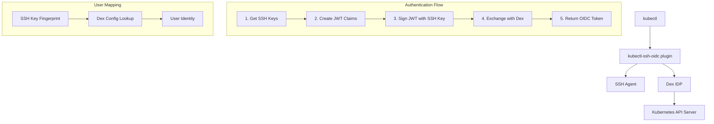

# kubectl-ssh-oidc Architecture

This document provides detailed technical documentation of the kubectl-ssh-oidc implementation, including the SSH agent signing flow and user matching mechanisms.

## 🏗️ System Architecture



## 🔐 SSH Agent Signing Flow

### Overview

The plugin creates a JWT token containing SSH key metadata and signs it using the private key from the SSH agent. This proves ownership of the SSH key without exposing the private key.

### Detailed Flow

#### 1. SSH Agent Connection
**File:** `pkg/kubectl/kubectl.go:60-78`

```go
func NewSSHAgentClient() (*SSHAgentClient, error) {
    authSock := os.Getenv("SSH_AUTH_SOCK")
    if authSock == "" {
        return nil, errors.New("SSH_AUTH_SOCK not set")
    }
    
    conn, err := net.Dial("unix", authSock)  // Line 66: Connect to SSH agent
    if err != nil {
        return nil, fmt.Errorf("failed to connect to SSH agent: %w", err)
    }
    
    return &SSHAgentClient{
        agent: agent.NewClient(conn),  // Line 72: Create SSH agent client
    }, nil
}
```

**Key Points:**
- Connects to SSH agent via Unix socket (`SSH_AUTH_SOCK`)
- Uses Go's `golang.org/x/crypto/ssh/agent` package
- Creates an `ExtendedAgent` interface for SSH operations

#### 2. SSH Key Retrieval
**File:** `pkg/kubectl/kubectl.go:53-78`

```go
func (c *SSHAgentClient) GetKeys() (keys []*agent.Key, err error) {
    keys, err = c.agent.List()  // Retrieve all keys from agent
    if err != nil {
        return nil, fmt.Errorf("failed to list SSH keys: %w", err)
    }
    
    if len(keys) == 0 {
        return nil, errors.New("no SSH keys found in agent")
    }
    
    return keys, nil
}
```

**Key Points:**
- Retrieves all SSH keys loaded in the agent
- Returns `[]*agent.Key` containing key metadata and public key blobs
- Plugin uses the first key (`keys[0]`) for signing

#### 3. JWT Claims Creation
**File:** `pkg/kubectl/kubectl.go:119-143`

```go
// Use the first available key
sshKey := keys[0]
pubKey, err := ssh.ParsePublicKey(sshKey.Blob)
if err != nil {
    return "", fmt.Errorf("failed to parse public key: %w", err)
}

// Generate key fingerprint
fingerprint := ssh.FingerprintSHA256(pubKey)  // Line 127: Create SHA256 fingerprint

// Create JWT claims
claims := &SSHJWTClaims{
    RegisteredClaims: jwt.RegisteredClaims{
        Issuer:    "kubectl-ssh-oidc",
        Audience:  jwt.ClaimStrings{config.Audience},
        Subject:   fingerprint,                    // Line 135: Fingerprint as subject
        ExpiresAt: jwt.NewNumericDate(now.Add(5 * time.Minute)),
        IssuedAt:  jwt.NewNumericDate(now),
        NotBefore: jwt.NewNumericDate(now),
    },
    KeyFingerprint: fingerprint,                   // Line 140: Fingerprint for lookup
    KeyComment:     sshKey.Comment,               // Line 141: SSH key comment
    PublicKey:      base64.StdEncoding.EncodeToString(sshKey.Blob), // Line 142: Public key
}
```

**Key Points:**
- Parses public key from agent's key blob
- Generates SHA256 fingerprint using `ssh.FingerprintSHA256()`
- Embeds fingerprint, comment, and public key in JWT claims
- Sets 5-minute expiration for security

#### 4. JWT Token Creation
**File:** `pkg/kubectl/kubectl.go:145-150`

```go
// Create unsigned token
token := jwt.NewWithClaims(jwt.SigningMethodNone, claims)
tokenString, err := token.SignedString(jwt.UnsafeAllowNoneSignatureType)
if err != nil {
    return "", fmt.Errorf("failed to create token: %w", err)
}
```

**Key Points:**
- Creates unsigned JWT token with `SigningMethodNone`
- Uses `jwt.UnsafeAllowNoneSignatureType` since SSH signature is separate
- Token contains all SSH key metadata but no cryptographic signature yet

#### 5. SSH Signing Operation
**File:** `pkg/kubectl/kubectl.go:80-100` and `152-157`

```go
// SignData signs data with the first available SSH key
func (c *SSHAgentClient) SignData(data []byte) (*ssh.Signature, ssh.PublicKey, error) {
    keys, err := c.GetKeys()
    if err != nil {
        return nil, nil, err
    }
    
    // Use the first key for signing
    key := keys[0]
    signature, err := c.agent.Sign(key, data)  // Line 89: **CRITICAL SSH AGENT CALL**
    if err != nil {
        return nil, nil, fmt.Errorf("failed to sign data: %w", err)
    }
    
    pubKey, err := ssh.ParsePublicKey(key.Blob)
    if err != nil {
        return nil, nil, fmt.Errorf("failed to parse public key: %w", err)
    }
    
    return signature, pubKey, nil
}

// In CreateSSHSignedJWT:
tokenBytes := []byte(tokenString)
signature, _, err := sshClient.SignData(tokenBytes)  // Line 154: Sign the JWT
if err != nil {
    return "", err
}
```

**Key Points:**
- **Line 89 is the critical SSH agent interaction**: `c.agent.Sign(key, data)`
- Signs the JWT token bytes with the SSH private key
- Returns `*ssh.Signature` containing `Blob` and `Format` fields
- Private key never leaves the SSH agent

#### 6. Final JWT Assembly
**File:** `pkg/kubectl/kubectl.go:159-172`

```go
// Create final JWT with SSH signature
signedToken := &SSHSignedJWT{
    Token:     tokenString,                                      // Line 161: Unsigned JWT
    Signature: base64.StdEncoding.EncodeToString(signature.Blob), // Line 162: SSH signature
    Format:    signature.Format,                                 // Line 163: Signature format
}

signedTokenBytes, err := json.Marshal(signedToken)
if err != nil {
    return "", fmt.Errorf("failed to marshal signed token: %w", err)
}

signedJWT = base64.StdEncoding.EncodeToString(signedTokenBytes)  // Line 171: Base64 encode
return signedJWT, nil
```

**Key Points:**
- Combines unsigned JWT with SSH signature
- Base64 encodes signature blob for JSON transport
- Preserves signature format (e.g., "rsa-sha2-256", "ecdsa-sha2-nistp256")
- Final result is base64-encoded JSON structure

### Data Structures

#### SSHJWTClaims
**File:** `pkg/kubectl/kubectl.go:31-37`

```go
type SSHJWTClaims struct {
    jwt.RegisteredClaims
    KeyFingerprint string `json:"key_fingerprint"` // SHA256:xxx format
    KeyComment     string `json:"key_comment,omitempty"`
    PublicKey      string `json:"public_key"`      // Base64-encoded key blob
}
```

#### SSHSignedJWT
**File:** `pkg/kubectl/kubectl.go:175-180`

```go
type SSHSignedJWT struct {
    Token     string `json:"token"`     // Unsigned JWT token
    Signature string `json:"signature"` // Base64-encoded signature blob
    Format    string `json:"format"`    // SSH signature format
}
```

## 👤 User Matching Mechanism

### Overview

The Dex SSH connector maps SSH key fingerprints to user identities through pre-configured authorization mappings. This allows centralized user management while leveraging existing SSH key infrastructure.

### Detailed Flow

#### 1. JWT Reception and Parsing
**File:** `pkg/ssh/ssh.go:85-98`

```go
func (c *SSHConnector) validateSSHJWT(sshJWTString string) (connector.Identity, error) {
    // Decode the base64-encoded SSH JWT
    sshJWTBytes, err := base64.StdEncoding.DecodeString(sshJWTString)
    if err != nil {
        return connector.Identity{}, fmt.Errorf("failed to decode SSH JWT: %w", err)
    }
    
    // Parse the SSH-signed JWT structure
    var sshJWT SSHSignedJWT
    parseErr := json.Unmarshal(sshJWTBytes, &sshJWT)
    if parseErr != nil {
        return connector.Identity{}, fmt.Errorf("failed to parse SSH JWT: %w", parseErr)
    }
```

#### 2. JWT Claims Extraction
**File:** `pkg/ssh/ssh.go:100-112`

```go
// Parse the JWT token (without verification first)
token, err := jwt.ParseWithClaims(sshJWT.Token, &SSHJWTClaims{}, func(token *jwt.Token) (interface{}, error) {
    // We'll verify the signature separately using SSH key
    return jwt.UnsafeAllowNoneSignatureType, nil
})
if err != nil {
    return connector.Identity{}, fmt.Errorf("failed to parse JWT: %w", err)
}

claims, ok := token.Claims.(*SSHJWTClaims)
if !ok {
    return connector.Identity{}, errors.New("invalid JWT claims")
}
```

#### 3. Signature Verification
**File:** `pkg/ssh/ssh.go:124-128` and `151-180`

```go
// Verify SSH signature
verifyErr := c.verifySSHSignature(sshJWT.Token, sshJWT.Signature, sshJWT.Format, claims.PublicKey)
if verifyErr != nil {
    return connector.Identity{}, fmt.Errorf("SSH signature verification failed: %w", verifyErr)
}

func (c *SSHConnector) verifySSHSignature(token, signatureB64, format, publicKeyB64 string) error {
    // Decode public key
    publicKeyBytes, err := base64.StdEncoding.DecodeString(publicKeyB64)
    if err != nil {
        return fmt.Errorf("failed to decode public key: %w", err)
    }
    
    publicKey, err := ssh.ParsePublicKey(publicKeyBytes)
    if err != nil {
        return fmt.Errorf("failed to parse public key: %w", err)
    }
    
    // Decode signature
    signatureBytes, err := base64.StdEncoding.DecodeString(signatureB64)
    if err != nil {
        return fmt.Errorf("failed to decode signature: %w", err)
    }
    
    // Create SSH signature structure
    signature := &ssh.Signature{
        Format: format,
        Blob:   signatureBytes,
    }
    
    // Verify signature
    data := []byte(token)
    verifyErr := publicKey.Verify(data, signature)  // Line 178: Cryptographic verification
    if verifyErr != nil {
        return fmt.Errorf("signature verification failed: %w", verifyErr)
    }
    
    return nil
}
```

**Key Points:**
- Verifies the SSH signature cryptographically
- Ensures the JWT wasn't tampered with
- Proves the sender owns the private key corresponding to the public key

#### 4. User Lookup by Fingerprint
**File:** `pkg/ssh/ssh.go:143-147` and `199-224`

```go
// Look up user info by SSH key fingerprint (supports multiple keys per user)
userInfo, err := c.findUserByKey(claims.KeyFingerprint)  // Line 144: **KEY LOOKUP**
if err != nil {
    return connector.Identity{}, fmt.Errorf("SSH key not authorized: %s - %w", claims.KeyFingerprint, err)
}

// findUserByKey implementation supports both formats
func (c *SSHConnector) findUserByKey(keyFingerprint string) (UserInfo, error) {
    // First, check the new Users format (multiple keys per user)
    for username, userConfig := range c.config.Users {
        for _, key := range userConfig.Keys {
            if key == keyFingerprint {
                userInfo := userConfig.UserInfo
                if userInfo.Username == "" {
                    userInfo.Username = username  // Auto-fill from map key
                }
                return userInfo, nil
            }
        }
    }

    // Fall back to legacy AuthorizedKeys format (one key per user)
    if c.config.AuthorizedKeys != nil {
        if userInfo, exists := c.config.AuthorizedKeys[keyFingerprint]; exists {
            return userInfo, nil
        }
    }

    return UserInfo{}, fmt.Errorf("key %s not found in authorized keys", keyFingerprint)
}
```

**Key Points:**
- **NEW:** Supports multiple SSH keys per user via `Users` configuration
- Uses `claims.KeyFingerprint` (SHA256 format) as lookup key
- Searches through all users and their associated keys
- Falls back to legacy `AuthorizedKeys` format for backward compatibility
- Rejects authentication if fingerprint not found in any format

#### 5. Identity Construction
**File:** `pkg/ssh/ssh.go:136-148`

```go
// Build identity
identity := connector.Identity{
    UserID:        userInfo.Username,    // Line 138: Set user ID
    Username:      userInfo.Username,    // Line 139: Set username
    Email:         userInfo.Email,       // Line 140: Set email
    EmailVerified: true,                 // Line 141: Mark as verified
    Groups:        append(userInfo.Groups, c.config.DefaultGroups...), // Line 142: Merge groups
}

return identity, nil
```

**Key Points:**
- Constructs Dex `connector.Identity` from user info
- Combines user-specific groups with default groups
- Marks email as verified (since SSH key ownership is verified)

### Configuration Structure

#### SSH Connector Config
**File:** `pkg/ssh/ssh.go:17-33` and `35-42`

```go
type Config struct {
    // Users maps usernames to their SSH key configuration and user information
    Users map[string]UserConfig `json:"users"`

    // AuthorizedKeys maps SSH key fingerprints to user information (DEPRECATED: use Users instead)
    // This field is maintained for backward compatibility
    AuthorizedKeys map[string]UserInfo `json:"authorized_keys,omitempty"`
    
    // AllowedIssuers specifies which JWT issuers are accepted
    AllowedIssuers []string `json:"allowed_issuers"`
    
    // DefaultGroups are assigned to all authenticated users
    DefaultGroups []string `json:"default_groups"`
    
    // TokenTTL specifies how long tokens are valid (in seconds)
    TokenTTL int `json:"token_ttl"`
}

// UserConfig contains a user's SSH keys and identity information
type UserConfig struct {
    // Keys is a list of SSH key fingerprints authorized for this user
    Keys []string `json:"keys"`

    // UserInfo contains the user's identity information
    UserInfo `json:",inline"`
}
```

#### User Information
**File:** `pkg/ssh/ssh.go:45-50`

```go
type UserInfo struct {
    Username string   `json:"username"`
    Email    string   `json:"email"`
    Groups   []string `json:"groups"`
    FullName string   `json:"full_name"`
}
```

### Example Dex Configuration

#### New Format (Multiple Keys Per User - Recommended)

```yaml
connectors:
- type: ssh
  id: ssh
  name: SSH Key Authentication
  config:
    users:
      "john.doe":
        keys:
        - "SHA256:AAAA...work-laptop-key"
        - "SHA256:BBBB...home-desktop-key" 
        - "SHA256:CCCC...yubikey-ssh-key"
        username: "john.doe"
        email: "john.doe@example.com" 
        full_name: "John Doe"
        groups:
        - "developers"
        - "kubernetes-users"
      
      "jane.smith":
        keys:
        - "SHA256:DDDD...jane-work-key"
        - "SHA256:EEEE...jane-personal-key"
        username: "jane.smith"
        email: "jane.smith@example.com"
        full_name: "Jane Smith"
        groups:
        - "developers"
        - "team-leads"
    
    allowed_issuers:
    - "kubectl-ssh-oidc"
    
    default_groups:
    - "authenticated"
    
    token_ttl: 3600
```

#### Legacy Format (One Key Per User - Deprecated)

```yaml
connectors:
- type: ssh
  id: ssh
  name: SSH Key Authentication  
  config:
    authorized_keys:
      "SHA256:AAAA...fingerprint1":
        username: "john.doe"
        email: "john.doe@example.com" 
        full_name: "John Doe"
        groups:
        - "developers"
        - "kubernetes-users"
      
      "SHA256:BBBB...fingerprint2":
        username: "jane.smith"
        email: "jane.smith@example.com"
        full_name: "Jane Smith"
        groups:
        - "developers"
        - "admins"
    
    allowed_issuers:
    - "kubectl-ssh-oidc"
    
    default_groups:
    - "authenticated"
    
    token_ttl: 3600
```

## 🔒 Security Model

### Trust Boundaries

1. **SSH Agent Security**: Private keys never leave the SSH agent
2. **Signature Verification**: Cryptographic proof of key ownership
3. **Fingerprint Mapping**: Pre-authorized key-to-user associations
4. **JWT Expiration**: Time-limited tokens (5 minutes default)
5. **Issuer Validation**: Only trusted issuers accepted

### Attack Mitigation

- **Replay Attacks**: JWT expiration and unique timestamps
- **Man-in-the-Middle**: SSH signature verification prevents tampering
- **Key Theft**: Private keys protected by SSH agent and hardware devices
- **Authorization Bypass**: Explicit fingerprint-to-user mapping required
- **Token Forgery**: SSH signature requirement prevents token creation

## 📊 Performance Considerations

### SSH Agent Operations
- **Key Listing**: `O(n)` where n is number of loaded keys
- **Signing**: `O(1)` cryptographic operation
- **Connection**: Persistent Unix socket connection

### Dex Connector Operations  
- **Fingerprint Lookup**: `O(1)` hash map lookup
- **Signature Verification**: `O(1)` cryptographic verification
- **JWT Parsing**: `O(1)` for typical token sizes

### Scalability
- **Concurrent Users**: Limited by SSH agent and Dex capacity
- **Key Count**: Linear degradation with number of loaded SSH keys
- **Network**: Minimal - single HTTP request per authentication

## 🛠️ Development Notes

### Testing
- **Unit Tests**: Mock SSH agent for deterministic testing
- **Integration Tests**: Real SSH agent with test keys
- **Coverage**: 35.1% for kubectl package, comprehensive for SSH connector

### Dependencies
- `golang.org/x/crypto/ssh`: SSH protocol implementation
- `golang.org/x/crypto/ssh/agent`: SSH agent client
- `github.com/golang-jwt/jwt/v5`: JWT handling
- `github.com/dexidp/dex/connector`: Dex connector interface

### Extension Points
- **Multiple Key Support**: Currently uses first key only
- **Hardware Keys**: Supports PKCS#11, PIV cards via SSH agent
- **Custom Claims**: Extensible JWT claims structure
- **Alternative Fingerprints**: Could support MD5 or other formats