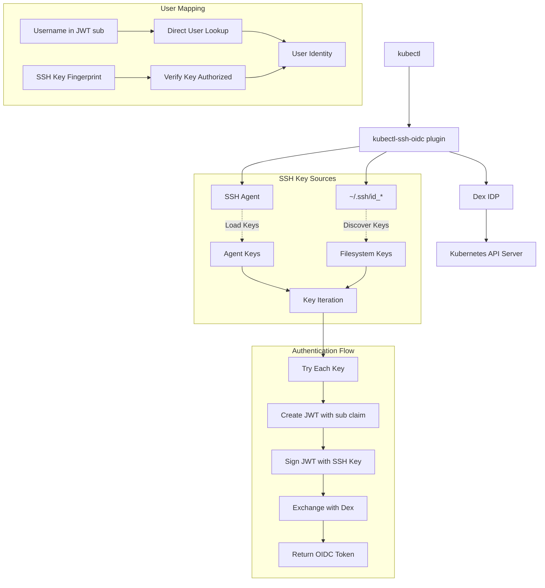

# kubectl-ssh-oidc Architecture

This document provides detailed technical documentation of the kubectl-ssh-oidc implementation, including the SSH agent signing flow and user matching mechanisms.

## 🏗️ System Architecture



## 🔐 SSH Key Authentication Flow

### Overview

The plugin supports both SSH agent and filesystem keys, following standard SSH client behavior. It tries each available key in sequence until authentication succeeds. The JWT contains a username claim (sub) for direct user lookup and includes key fingerprint for authorization verification.

### Detailed Flow

#### 1. UnifiedSSHClient Setup
**File:** `pkg/kubectl/kubectl.go:98-150`

```go
func NewUnifiedSSHClient(config *Config) (*UnifiedSSHClient, error) {
    client := &UnifiedSSHClient{
        config: config,
    }
    
    // Initialize SSH agent if requested
    if config.UseAgent {
        if authSock := os.Getenv("SSH_AUTH_SOCK"); authSock != "" {
            conn, err := net.Dial("unix", authSock)
            if err == nil {
                client.agent = agent.NewClient(conn)
            }
        }
    }
    
    return client, nil
}
```

**Key Points:**
- Unified client supporting both SSH agent and filesystem keys
- Configurable via `SSH_USE_AGENT` environment variable (default: true)
- Gracefully handles missing SSH agent
- Supports custom key paths via `SSH_KEY_PATHS`

#### 2. SSH Key Discovery and Iteration
**File:** `pkg/kubectl/kubectl.go:203-245` and `296-365`

```go
func (c *UnifiedSSHClient) GetAllKeys() ([]SSHKey, error) {
    var allKeys []SSHKey
    
    // Get keys from SSH agent if enabled
    if c.config.UseAgent && c.agent != nil {
        agentKeys, err := c.agent.List()
        if err == nil {
            for _, agentKey := range agentKeys {
                allKeys = append(allKeys, SSHKey{
                    Source:     "agent",
                    AgentKey:   agentKey,
                })
            }
        }
    }
    
    // Get keys from filesystem
    fsKeys, err := c.getFilesystemKeys()
    if err == nil {
        allKeys = append(allKeys, fsKeys...)
    }
    
    return allKeys, nil
}

// Multi-key authentication with iteration
func CreateSSHSignedJWT(config *Config) (string, error) {
    client, err := NewUnifiedSSHClient(config)
    if err != nil {
        return "", fmt.Errorf("failed to create SSH client: %w", err)
    }
    
    keys, err := client.GetAllKeys()
    if err != nil {
        return "", fmt.Errorf("failed to get SSH keys: %w", err)
    }
    
    // Try each key in sequence (standard SSH behavior)
    var keyErrors []KeyAuthError
    for i, sshKey := range keys {
        signedJWT, err := tryKeyAuthentication(client, sshKey, config, i+1)
        if err == nil {
            return signedJWT, nil // Success!
        }
        keyErrors = append(keyErrors, KeyAuthError{
            KeyIndex: i + 1,
            Source:   sshKey.Source,
            Error:    err,
        })
    }
    
    // All keys failed
    return "", &MultiKeyAuthError{KeyErrors: keyErrors}
}
```

**Key Points:**
- Discovers keys from both SSH agent and filesystem following SSH client defaults
- Standard SSH location discovery: `id_ed25519`, `id_rsa`, `id_ecdsa`, etc.
- Tries each key in sequence until one succeeds (standard SSH behavior)
- Supports encrypted filesystem keys with passphrase prompting (3 attempts)
- Comprehensive error reporting showing all key attempts

#### 3. JWT Claims Creation (jwt-ssh-agent Pattern)
**File:** `pkg/kubectl/kubectl.go:460-510`

```go
// JWT with standard claims following jwt-ssh-agent pattern
claims := jwt.MapClaims{
    "sub": config.Username,                // Username for user lookup (O(1) performance)
    "aud": config.Audience,               // Audience claim (e.g., "kubernetes")
    "iss": "kubectl-ssh-oidc",           // Issuer
    "jti": generateJTI(),                 // JWT ID for uniqueness
    "exp": time.Now().Add(5*time.Minute).Unix(), // Short expiration
    "iat": time.Now().Unix(),            // Issued at
    "nbf": time.Now().Unix(),            // Not before
    "key_fingerprint": fingerprint,      // SSH key fingerprint for authorization check
    "public_key": base64.StdEncoding.EncodeToString(pubKeyBlob), // Public key for verification
}

// Create JWT token
token := jwt.NewWithClaims(&SSHSigningMethod{}, claims)
```

**Key Points:**
- Uses standard JWT claims: `sub`, `aud`, `jti`, `exp` (following jwt-ssh-agent pattern)
- `sub` claim contains username for direct O(1) user lookup
- `key_fingerprint` used to verify the key is authorized for this user
- `public_key` embedded for signature verification
- Short 5-minute expiration for security

#### 4. JWT Token Creation and Signing
**File:** `pkg/kubectl/kubectl.go:510-540`

```go
// Create JWT with custom SSH signing method
token := jwt.NewWithClaims(&SSHSigningMethod{}, claims)

// Sign directly with SSH key (agent or filesystem)
signedString, err := token.SignedString(sshKey)
if err != nil {
    return "", fmt.Errorf("failed to sign token: %w", err)
}
```

**Key Points:**
- Uses custom `SSHSigningMethod` that implements `jwt.SigningMethod` interface  
- Signs JWT directly with SSH private key through unified client
- Supports both SSH agent and filesystem keys seamlessly
- No separate signature step - JWT library handles signing process

#### 5. SSH Signing Operations (Agent and Filesystem)
**File:** `pkg/kubectl/kubectl.go:580-650`

```go
// SSHSigningMethod implements jwt.SigningMethod for direct SSH signing
func (m *SSHSigningMethod) Sign(signingString string, key interface{}) ([]byte, error) {
    sshKey, ok := key.(SSHKey)
    if !ok {
        return nil, fmt.Errorf("SSH signing requires SSHKey, got %T", key)
    }
    
    data := []byte(signingString)
    
    // Sign with agent key
    if sshKey.Source == "agent" && sshKey.AgentKey != nil {
        signature, err := m.client.agent.Sign(sshKey.AgentKey, data)
        if err != nil {
            return nil, fmt.Errorf("failed to sign with agent key: %w", err)
        }
        return m.encodeSignature(signature), nil
    }
    
    // Sign with filesystem key
    if sshKey.Source == "filesystem" && sshKey.Signer != nil {
        signature, err := sshKey.Signer.Sign(rand.Reader, data)
        if err != nil {
            return nil, fmt.Errorf("failed to sign with filesystem key: %w", err)
        }
        return m.encodeSignature(signature), nil
    }
    
    return nil, errors.New("no valid signing method available")
}
```

**Key Points:**
- Unified signing supporting both SSH agent and filesystem keys
- **SSH Agent**: Uses `agent.Sign(key, data)` - private key stays in agent  
- **Filesystem**: Uses `crypto.Signer.Sign()` - handles encrypted keys with passphrase prompting
- Consistent signature encoding regardless of key source
- Private keys never exposed - all signing operations are abstracted

### Data Structures

#### UnifiedSSHClient
**File:** `pkg/kubectl/kubectl.go:67-75`

```go
type UnifiedSSHClient struct {
    agent  agent.ExtendedAgent // SSH agent connection (optional)
    config *Config             // Configuration (SSH_USE_AGENT, paths, etc.)
}
```

#### SSHKey
**File:** `pkg/kubectl/kubectl.go:85-95`

```go
type SSHKey struct {
    Source      string          // "agent" or "filesystem"
    AgentKey    *agent.Key      // For agent keys
    Signer      crypto.Signer   // For filesystem keys  
    PublicKey   ssh.PublicKey   // Parsed public key
    Fingerprint string          // SHA256 fingerprint
    Comment     string          // Key comment/label
}
```

#### Config
**File:** `pkg/kubectl/kubectl.go:31-40`

```go
type Config struct {
    DexURL       string   `json:"dex_url"`
    ClientID     string   `json:"client_id"`
    Audience     string   `json:"audience"`
    Username     string   `json:"username"`        // For JWT sub claim
    UseAgent     bool     `json:"use_agent"`       // Default: true
    SSHKeyPaths  []string `json:"ssh_key_paths,omitempty"` // Custom key locations
    IdentitiesOnly bool   `json:"identities_only,omitempty"` // Use only specified keys
}
```

## 👤 User Matching Mechanism

### Overview

The Dex SSH connector uses JWT-based authentication with direct username lookup (O(1) performance) and SSH key authorization verification. The username comes from the JWT `sub` claim, eliminating the need to search through all users.

### Detailed Flow

#### 1. JWT Reception and Parsing (jwt-ssh-agent approach)
**File:** `pkg/ssh/ssh.go:93-130`

```go
func (c *SSHConnector) validateSSHJWT(sshJWTString string) (connector.Identity, error) {
    // Register SSH signing method for JWT parsing
    jwt.RegisterSigningMethod("SSH", func() jwt.SigningMethod {
        return &SSHSigningMethodServer{}
    })

    // Parse JWT directly using jwt-ssh-agent approach
    token, err := jwt.Parse(sshJWTString, func(token *jwt.Token) (interface{}, error) {
        // Verify signing algorithm is SSH
        if token.Method.Alg() != "SSH" {
            return nil, fmt.Errorf("unexpected signing method: %v", token.Header["alg"])
        }

        // Extract public key from claims for verification
        claims, ok := token.Claims.(jwt.MapClaims)
        if !ok {
            return nil, errors.New("invalid claims format")
        }

        publicKeyB64, ok := claims["public_key"].(string)
        if !ok {
            return nil, errors.New("missing public_key claim")
        }

        // Parse SSH public key for verification
        publicKeyBytes, err := base64.StdEncoding.DecodeString(publicKeyB64)
        if err != nil {
            return nil, fmt.Errorf("failed to decode public key: %w", err)
        }

        publicKey, err := ssh.ParsePublicKey(publicKeyBytes)
        if err != nil {
            return nil, fmt.Errorf("failed to parse public key: %w", err)
        }

        return publicKey, nil
    })
```

#### 2. JWT Claims Validation (Standards Compliant)
**File:** `pkg/ssh/ssh.go:130-180`

```go
// Extract and validate standard JWT claims
claims, ok := token.Claims.(jwt.MapClaims)
if !ok {
    return connector.Identity{}, errors.New("invalid JWT claims format")
}

// Validate required standard claims
sub, ok := claims["sub"].(string)
if !ok || sub == "" {
    return connector.Identity{}, errors.New("missing or invalid sub claim")
}

aud, ok := claims["aud"].(string) 
if !ok || aud == "" {
    return connector.Identity{}, errors.New("missing or invalid aud claim")
}

// Validate audience - ensure token is intended for this Dex instance
if aud != "kubernetes" {
    return connector.Identity{}, fmt.Errorf("invalid audience: %s", aud)
}

// Validate issuer
iss, ok := claims["iss"].(string)
if !ok || iss == "" {
    return connector.Identity{}, errors.New("missing or invalid iss claim")
}

if !c.isAllowedIssuer(iss) {
    return connector.Identity{}, fmt.Errorf("invalid issuer: %s", iss)
}

// Validate expiration (critical security check)
exp, ok := claims["exp"].(float64)
if !ok {
    return connector.Identity{}, errors.New("missing or invalid exp claim")
}

if time.Unix(int64(exp), 0).Before(time.Now()) {
    return connector.Identity{}, errors.New("token has expired")
}
```

#### 3. SSH Signature Verification (Built into JWT parsing)
**File:** `pkg/ssh/ssh.go:385-415`

```go
// SSHSigningMethodServer verifies SSH signatures during JWT parsing
func (m *SSHSigningMethodServer) Verify(signingString string, signature []byte, key interface{}) error {
    // Parse SSH public key
    publicKey, ok := key.(ssh.PublicKey)
    if !ok {
        return fmt.Errorf("SSH verification requires ssh.PublicKey, got %T", key)
    }

    // Decode the base64-encoded signature
    signatureStr := string(signature)
    signatureBytes, err := base64.StdEncoding.DecodeString(signatureStr)
    if err != nil {
        return fmt.Errorf("failed to decode signature: %w", err)
    }

    // Construct SSH signature structure
    sshSignature := &ssh.Signature{
        Format: publicKey.Type(), // Use key type as format
        Blob:   signatureBytes,
    }

    // Verify the signature cryptographically
    err = publicKey.Verify([]byte(signingString), sshSignature)
    if err != nil {
        return fmt.Errorf("SSH signature verification failed: %w", err)
    }

    return nil
}
```

**Key Points:**
- JWT signature verification integrated into JWT parsing (jwt-ssh-agent pattern)
- Cryptographic verification using SSH public key from JWT claims
- Proves ownership of SSH private key without exposing it
- Ensures JWT integrity and authenticity

#### 4. Direct User Lookup with Key Authorization (O(1) Performance)
**File:** `pkg/ssh/ssh.go:185-202`

```go
// Extract key fingerprint for authorization check
keyFingerprint, ok := claims["key_fingerprint"].(string)
if !ok || keyFingerprint == "" {
    return connector.Identity{}, errors.New("missing or invalid key_fingerprint claim")
}

// Look up user info by username (sub claim) and verify key is authorized
userInfo, err := c.findUserByUsernameAndKey(sub, keyFingerprint)
if err != nil {
    return connector.Identity{}, fmt.Errorf("SSH authentication failed for user %s with key %s: %w", sub, keyFingerprint, err)
}

// findUserByUsernameAndKey provides O(1) lookup performance
func (c *SSHConnector) findUserByUsernameAndKey(username, keyFingerprint string) (UserInfo, error) {
    // Direct O(1) lookup by username
    if userConfig, exists := c.config.Users[username]; exists {
        // Check if this key is authorized for this user
        for _, authorizedKey := range userConfig.Keys {
            if authorizedKey == keyFingerprint {
                userInfo := userConfig.UserInfo
                if userInfo.Username == "" {
                    userInfo.Username = username
                }
                return userInfo, nil
            }
        }
        return UserInfo{}, fmt.Errorf("key %s not authorized for user %s", keyFingerprint, username)
    }

    // Fall back to legacy format (O(n) search)
    if c.config.AuthorizedKeys != nil {
        if userInfo, exists := c.config.AuthorizedKeys[keyFingerprint]; exists {
            if userInfo.Username == username {
                return userInfo, nil
            }
            return UserInfo{}, fmt.Errorf("key %s belongs to user %s, not %s", keyFingerprint, userInfo.Username, username)
        }
    }

    return UserInfo{}, fmt.Errorf("user %s not found or key %s not authorized", username, keyFingerprint)
}
```

**Key Points:**
- **NEW:** Direct O(1) user lookup using JWT `sub` claim (username)
- Efficient key authorization verification (no need to search all users)  
- Supports multiple SSH keys per user via new `Users` configuration format
- Falls back to legacy `AuthorizedKeys` format for backward compatibility
- Rejects authentication if user not found or key not authorized

#### 5. Identity Construction
**File:** `pkg/ssh/ssh.go:136-148`

```go
// Build identity
identity := connector.Identity{
    UserID:        userInfo.Username,    // Line 138: Set user ID
    Username:      userInfo.Username,    // Line 139: Set username
    Email:         userInfo.Email,       // Line 140: Set email
    EmailVerified: true,                 // Line 141: Mark as verified
    Groups:        append(userInfo.Groups, c.config.DefaultGroups...), // Line 142: Merge groups
}

return identity, nil
```

**Key Points:**
- Constructs Dex `connector.Identity` from user info
- Combines user-specific groups with default groups
- Marks email as verified (since SSH key ownership is verified)

### Configuration Structure

#### SSH Connector Config
**File:** `pkg/ssh/ssh.go:17-33` and `35-42`

```go
type Config struct {
    // Users maps usernames to their SSH key configuration and user information
    Users map[string]UserConfig `json:"users"`

    // AuthorizedKeys maps SSH key fingerprints to user information (DEPRECATED: use Users instead)
    // This field is maintained for backward compatibility
    AuthorizedKeys map[string]UserInfo `json:"authorized_keys,omitempty"`
    
    // AllowedIssuers specifies which JWT issuers are accepted
    AllowedIssuers []string `json:"allowed_issuers"`
    
    // DefaultGroups are assigned to all authenticated users
    DefaultGroups []string `json:"default_groups"`
    
    // TokenTTL specifies how long tokens are valid (in seconds)
    TokenTTL int `json:"token_ttl"`
}

// UserConfig contains a user's SSH keys and identity information
type UserConfig struct {
    // Keys is a list of SSH key fingerprints authorized for this user
    Keys []string `json:"keys"`

    // UserInfo contains the user's identity information
    UserInfo `json:",inline"`
}
```

#### User Information
**File:** `pkg/ssh/ssh.go:45-50`

```go
type UserInfo struct {
    Username string   `json:"username"`
    Email    string   `json:"email"`
    Groups   []string `json:"groups"`
    FullName string   `json:"full_name"`
}
```

### Example Dex Configuration

#### New Format (Multiple Keys Per User - Recommended)

```yaml
connectors:
- type: ssh
  id: ssh
  name: SSH Key Authentication
  config:
    users:
      "john.doe":
        keys:
        - "SHA256:AAAA...work-laptop-key"
        - "SHA256:BBBB...home-desktop-key" 
        - "SHA256:CCCC...yubikey-ssh-key"
        username: "john.doe"
        email: "john.doe@example.com" 
        full_name: "John Doe"
        groups:
        - "developers"
        - "kubernetes-users"
      
      "jane.smith":
        keys:
        - "SHA256:DDDD...jane-work-key"
        - "SHA256:EEEE...jane-personal-key"
        username: "jane.smith"
        email: "jane.smith@example.com"
        full_name: "Jane Smith"
        groups:
        - "developers"
        - "team-leads"
    
    allowed_issuers:
    - "kubectl-ssh-oidc"
    
    default_groups:
    - "authenticated"
    
    token_ttl: 3600
```

#### Legacy Format (One Key Per User - Deprecated)

```yaml
connectors:
- type: ssh
  id: ssh
  name: SSH Key Authentication  
  config:
    authorized_keys:
      "SHA256:AAAA...fingerprint1":
        username: "john.doe"
        email: "john.doe@example.com" 
        full_name: "John Doe"
        groups:
        - "developers"
        - "kubernetes-users"
      
      "SHA256:BBBB...fingerprint2":
        username: "jane.smith"
        email: "jane.smith@example.com"
        full_name: "Jane Smith"
        groups:
        - "developers"
        - "admins"
    
    allowed_issuers:
    - "kubectl-ssh-oidc"
    
    default_groups:
    - "authenticated"
    
    token_ttl: 3600
```

## 🔒 Security Model

### Trust Boundaries

1. **SSH Agent Security**: Private keys never leave the SSH agent
2. **Signature Verification**: Cryptographic proof of key ownership
3. **Fingerprint Mapping**: Pre-authorized key-to-user associations
4. **JWT Expiration**: Time-limited tokens (5 minutes default)
5. **Issuer Validation**: Only trusted issuers accepted

### Attack Mitigation

- **Replay Attacks**: JWT expiration and unique timestamps
- **Man-in-the-Middle**: SSH signature verification prevents tampering
- **Key Theft**: Private keys protected by SSH agent and hardware devices
- **Authorization Bypass**: Explicit fingerprint-to-user mapping required
- **Token Forgery**: SSH signature requirement prevents token creation

## 📊 Performance Considerations

### SSH Agent Operations
- **Key Listing**: `O(n)` where n is number of loaded keys
- **Signing**: `O(1)` cryptographic operation
- **Connection**: Persistent Unix socket connection

### Dex Connector Operations  
- **Fingerprint Lookup**: `O(1)` hash map lookup
- **Signature Verification**: `O(1)` cryptographic verification
- **JWT Parsing**: `O(1)` for typical token sizes

### Scalability
- **Concurrent Users**: Limited by SSH agent and Dex capacity
- **Key Count**: Linear degradation with number of loaded SSH keys
- **Network**: Minimal - single HTTP request per authentication

## 🛠️ Development Notes

### Testing
- **Unit Tests**: Mock SSH agent for deterministic testing
- **Integration Tests**: Real SSH agent with test keys
- **Coverage**: 35.1% for kubectl package, comprehensive for SSH connector

### Dependencies
- `golang.org/x/crypto/ssh`: SSH protocol implementation
- `golang.org/x/crypto/ssh/agent`: SSH agent client
- `github.com/golang-jwt/jwt/v5`: JWT handling
- `github.com/dexidp/dex/connector`: Dex connector interface

### Extension Points
- ✅ **Multiple Key Support**: Implemented with standard SSH client iteration behavior
- ✅ **Filesystem Keys**: Full support with passphrase prompting
- **Hardware Keys**: Supports PKCS#11, PIV cards via SSH agent
- **Custom Claims**: Extensible JWT claims structure  
- **Alternative Fingerprints**: Could support MD5 or other formats
- **Key Caching**: Could cache successful key for session performance