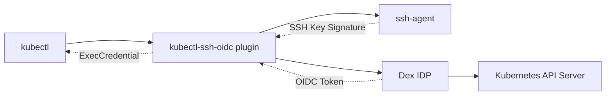

# kubectl-ssh-oidc

[](https://goreportcard.com/report/github.com/nikogura/kubectl-ssh-oidc)
[](https://opensource.org/licenses/MIT)
[](https://github.com/nikogura/kubectl-ssh-oidc/releases)

A kubectl plugin that provides **passwordless authentication** to Kubernetes clusters using SSH keys via ssh-agent and Dex Identity Provider.

## 🚀 Overview

This plugin eliminates the need for passwords, browser-based OAuth flows, or manually managing tokens by leveraging your existing SSH infrastructure. It combines SSH key authentication with OIDC to provide seamless Kubernetes access.

### Key Benefits

- ✅ **Passwordless**: Uses SSH keys already in your ssh-agent
- ✅ **No Browser Required**: Direct CLI authentication
- ✅ **Existing SSH Infrastructure**: Leverages current SSH key management
- ✅ **Hardware Security**: Supports hardware-backed SSH keys (PKCS#11, PIV cards)
- ✅ **Centralized Identity**: Integrates with Dex for user/group management
- ✅ **Standard OIDC**: Works with any Kubernetes cluster supporting OIDC

## 🏗️ Architecture



**Authentication Flow:**
1. User runs `kubectl` command
2. kubectl calls `kubectl-ssh-oidc` plugin  
3. Plugin creates JWT with SSH key metadata
4. Plugin signs JWT using SSH private key from agent
5. Plugin exchanges signed JWT with Dex
6. Dex validates SSH signature and returns OIDC token
7. kubectl uses OIDC token to authenticate with Kubernetes API

## 📦 Installation

### Quick Install

```bash
# Download latest release for your platform
# Linux AMD64
curl -L "https://github.com/nikogura/kubectl-ssh-oidc/releases/latest/download/kubectl-ssh_oidc-linux-amd64" -o kubectl-ssh_oidc

# macOS AMD64 (Intel)
curl -L "https://github.com/nikogura/kubectl-ssh-oidc/releases/latest/download/kubectl-ssh_oidc-darwin-amd64" -o kubectl-ssh_oidc

# macOS ARM64 (Apple Silicon)
curl -L "https://github.com/nikogura/kubectl-ssh-oidc/releases/latest/download/kubectl-ssh_oidc-darwin-arm64" -o kubectl-ssh_oidc

# Make executable and install
chmod +x kubectl-ssh_oidc
sudo mv kubectl-ssh_oidc /usr/local/bin/
```

### Build from Source

```bash
git clone https://github.com/nikogura/kubectl-ssh-oidc
cd kubectl-ssh-oidc

# Build and install to user directory
make install

# Or install system-wide (requires sudo)
make install-system
```

## ⚙️ Configuration

### 1. SSH Agent Setup

```bash
# Start ssh-agent (if not running)
eval $(ssh-agent -s)

# Add your SSH key
ssh-add ~/.ssh/id_rsa

# Verify keys are loaded
ssh-add -l
```

### 2. Get SSH Key Fingerprints

```bash
# Generate fingerprints for Dex configuration
make ssh-fingerprints

# Or manually get fingerprints
ssh-add -l
```

### 3. Configure Dex

Create or update your Dex configuration:

```yaml
# dex-config.yaml
issuer: https://dex.example.com

staticClients:
- id: kubectl-ssh-oidc
  redirectURIs:
  - 'urn:ietf:wg:oauth:2.0:oob'
  name: 'kubectl SSH OIDC Plugin'
  secret: kubectl-ssh-oidc-secret

connectors:
- type: ssh
  id: ssh
  name: SSH Key Authentication
  config:
    # New format: Multiple keys per user (recommended)
    users:
      "john.doe":
        keys:
        - "SHA256:work-laptop-key-fingerprint"
        - "SHA256:home-desktop-key-fingerprint" 
        - "SHA256:yubikey-ssh-key-fingerprint"
        username: "john.doe"
        email: "john.doe@example.com"
        full_name: "John Doe"
        groups:
        - "developers"
        - "kubernetes-users"
      
      "jane.smith":
        keys:
        - "SHA256:jane-work-key-fingerprint"
        - "SHA256:jane-personal-key-fingerprint"
        username: "jane.smith"
        email: "jane.smith@example.com"
        full_name: "Jane Smith"
        groups:
        - "developers"
        - "team-leads"
    
    # Legacy format: One key per user (deprecated but still supported)
    # authorized_keys:
    #   "SHA256:legacy-key-fingerprint":
    #     username: "legacy.user"
    #     email: "legacy@example.com"
    #     full_name: "Legacy User"
    #     groups:
    #     - "legacy-group"
    
    allowed_issuers:
    - "kubectl-ssh-oidc"
    
    default_groups:
    - "authenticated"
    
    token_ttl: 3600
```

### 4. Deploy Custom Dex with SSH Connector

The SSH connector is included in this repository in the `pkg/ssh` package and acts as a Dex connector. To use it:

```bash
# Build a custom Dex with the SSH connector
# 1. Clone Dex repository
git clone https://github.com/dexidp/dex
cd dex

# 2. Copy the SSH connector from this repo
cp -r /path/to/kubectl-ssh-oidc/pkg/ssh ./connector/ssh

# 3. Add SSH connector import to cmd/dex/serve.go
# Add: _ "github.com/dexidp/dex/connector/ssh"

# 4. Build custom Dex
make build
```

### 5. Configure Kubernetes Cluster

Update your kube-apiserver to accept OIDC tokens:

```yaml
# kube-apiserver configuration
apiServer:
  extraArgs:
    oidc-issuer-url: "https://dex.example.com"
    oidc-client-id: "kubernetes"
    oidc-username-claim: "email"
    oidc-groups-claim: "groups"
```

### 6. Configure kubectl

Update your kubeconfig:

```yaml
apiVersion: v1
kind: Config
users:
- name: ssh-oidc-user
  user:
    exec:
      apiVersion: client.authentication.k8s.io/v1beta1
      command: kubectl-ssh_oidc
      args:
      - "https://dex.example.com"
      - "kubectl-ssh-oidc"
      env:
      - name: DEX_URL
        value: "https://dex.example.com"

contexts:
- name: ssh-oidc-context
  context:
    cluster: your-cluster
    user: ssh-oidc-user
```

## 🎯 Usage

### Basic Usage

```bash
# Use the SSH OIDC context
kubectl config use-context ssh-oidc-context

# Now all kubectl commands authenticate via SSH
kubectl get pods
kubectl get nodes
kubectl logs deployment/my-app
```

### Environment Variables

```bash
export DEX_URL="https://dex.example.com"
export CLIENT_ID="kubectl-ssh-oidc"
export AUDIENCE="kubernetes"
export CACHE_TOKENS="true"
```

### Direct Plugin Usage

```bash
# Generate credentials manually
kubectl-ssh_oidc https://dex.example.com kubectl-ssh-oidc
```

## 🔐 RBAC Configuration

Create RBAC rules for your users and groups:

```yaml
# Developer access
apiVersion: rbac.authorization.k8s.io/v1
kind: ClusterRoleBinding
metadata:
  name: ssh-oidc-developers
roleRef:
  apiGroup: rbac.authorization.k8s.io
  kind: ClusterRole
  name: edit
subjects:
- kind: Group
  name: "developers"
  apiGroup: rbac.authorization.k8s.io

---
# Admin access
apiVersion: rbac.authorization.k8s.io/v1
kind: ClusterRoleBinding
metadata:
  name: ssh-oidc-admins
roleRef:
  apiGroup: rbac.authorization.k8s.io
  kind: ClusterRole
  name: cluster-admin
subjects:
- kind: Group
  name: "kubernetes-admins"
  apiGroup: rbac.authorization.k8s.io
```

## 🛠️ Development

### Prerequisites

- Go 1.21+
- SSH agent with loaded keys
- Running Dex instance

### Build

```bash
# Build for current platform
make build

# Cross-compile for all platforms
make build-all

# Run tests
make test

# Lint code
make lint
```

### Project Structure

```
kubectl-ssh-oidc/
├── cmd/kubectl-ssh-oidc/     # Main plugin executable
├── pkg/
│   ├── kubectl/              # kubectl plugin implementation
│   │   └── mocks/            # Mock objects for testing
│   └── ssh/                  # Dex SSH connector implementation
│       └── mocks/            # SSH connector mocks
├── testdata/                 # Test helper functions
├── integration_test.go       # End-to-end integration tests
├── Makefile                  # Build automation
├── README.md                 # This file
├── Usage.md                  # Usage documentation
└── go.mod                    # Go module definition
```

## 🔧 Troubleshooting

### Check SSH Agent Status

```bash
make check-ssh
```

### Common Issues

| Issue | Solution |
|-------|----------|
| `No SSH keys in agent` | `ssh-add ~/.ssh/id_rsa` |
| `SSH agent not running` | `eval $(ssh-agent -s)` |
| `Key not authorized in Dex` | Check fingerprint matches Dex config |
| `OIDC validation failed` | Verify kube-apiserver OIDC settings |
| `Permission denied` | Check RBAC configuration |

### Debug Mode

```bash
export DEBUG=true
kubectl-ssh_oidc https://dex.example.com
```

## 🔒 Security Considerations

- **SSH Key Security**: Use strong key types (Ed25519, RSA 4096+, ECDSA P-384)
- **Key Rotation**: Regularly rotate SSH keys and update Dex configuration
- **Hardware Keys**: Consider using hardware-backed SSH keys (YubiKey, etc.)
- **Network Security**: Always use TLS for Dex and Kubernetes API communications
- **Audit Logging**: Enable audit logging in Kubernetes for authentication events
- **Principle of Least Privilege**: Use RBAC to limit user permissions

## 🚦 Supported Platforms

| Platform | Architecture | Status |
|----------|-------------|---------|
| Linux | amd64 | ✅ Supported |
| Linux | arm64 | ✅ Supported |
| macOS | amd64 (Intel) | ✅ Supported |
| macOS | arm64 (Apple Silicon) | ✅ Supported |
| Windows | amd64 | ✅ Supported |

## 📊 Project Status

This project includes:
- ✅ **kubectl plugin**: Complete implementation in `pkg/kubectl/`
- ✅ **Dex SSH connector**: Complete implementation in `pkg/ssh/`
- ✅ **Comprehensive tests**: Unit tests and integration tests
- ✅ **Cross-platform builds**: Automated build pipeline
- ✅ **Documentation**: Usage examples and configuration guides
- ⚠️ **Binary releases**: Set up GitHub Actions for automated releases

## 📋 Requirements

- **kubectl**: v1.20+
- **Go**: 1.24+ (for building from source)
- **SSH Agent**: OpenSSH ssh-agent or compatible
- **Dex**: v2.35+ with custom SSH connector (see [Usage.md](Usage.md) for setup)
- **Kubernetes**: v1.20+ with OIDC support configured

## 🤝 Contributing

We welcome contributions! Please see our [Contributing Guide](CONTRIBUTING.md) for details.

1. Fork the repository
2. Create a feature branch (`git checkout -b feature/amazing-feature`)
3. Commit your changes (`git commit -m 'Add amazing feature'`)
4. Push to the branch (`git push origin feature/amazing-feature`)
5. Open a Pull Request

## 📄 License

This project is licensed under the MIT License - see the [LICENSE](LICENSE) file for details.

## 🙏 Acknowledgments

- [Dex Identity Service](https://dexidp.io/) for the extensible OIDC provider
- [kubelogin](https://github.com/int128/kubelogin) for kubectl OIDC integration patterns
- [jwt-ssh-agent-go](https://github.com/nikogura/jwt-ssh-agent-go) for SSH agent JWT concepts
- The Kubernetes community for the exec credential plugin interface

## 📞 Support

- 📖 [Usage Documentation](Usage.md)
- 🏠 [Architecture & Technical Details](ARCHITECTURE.md)
- ⚠️ [Limitations & Known Issues](LIMITATIONS.md)
- 🔑 [SSH Key Iteration Pattern](SSH_KEY_ITERATION.md)
- 🐛 [Issue Tracker](https://github.com/nikogura/kubectl-ssh-oidc/issues)
- 💬 [Discussions](https://github.com/nikogura/kubectl-ssh-oidc/discussions)

---

**Made with ❤️ for the Kubernetes community**