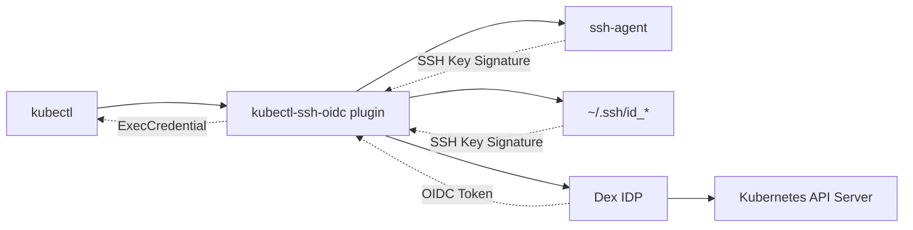

# kubectl-ssh-oidc

[](https://goreportcard.com/report/github.com/nikogura/kubectl-ssh-oidc)
[](https://opensource.org/licenses/MIT)
[](https://github.com/nikogura/kubectl-ssh-oidc/releases)

A kubectl plugin that provides **passwordless authentication** to Kubernetes clusters using SSH keys from ssh-agent or filesystem and Dex Identity Provider.

## 🚀 Overview

This plugin eliminates the need for passwords, browser-based OAuth flows, or manually managing tokens by leveraging your existing SSH infrastructure. It combines SSH key authentication with OIDC to provide seamless Kubernetes access.

### Key Benefits

- ✅ **Passwordless**: Uses SSH keys from ssh-agent or filesystem
- ✅ **No Browser Required**: Direct CLI authentication
- ✅ **Flexible SSH Keys**: Works with ssh-agent, filesystem keys, or encrypted keys
- ✅ **Standard SSH Behavior**: Follows SSH client key discovery and iteration
- ✅ **Passphrase Support**: Interactive prompts for encrypted private keys
- ✅ **Hardware Security**: Supports hardware-backed SSH keys (PKCS#11, PIV cards)
- ✅ **Centralized Identity**: Integrates with Dex for user/group management
- ✅ **Standard OIDC**: Works with any Kubernetes cluster supporting OIDC

## 🏗️ Architecture



**Authentication Flow:**
1. User runs `kubectl` command
2. kubectl calls `kubectl-ssh-oidc` plugin  
3. Plugin discovers SSH keys from ssh-agent and/or filesystem (standard SSH locations)
4. Plugin creates JWT with SSH key metadata and standard claims (sub, aud, jti, exp)
5. Plugin signs JWT directly using SSH private key (follows jwt-ssh-agent pattern)
6. Plugin exchanges signed JWT with Dex
7. Dex validates SSH signature, expiration, and audience claims then returns OIDC token
8. kubectl uses OIDC token to authenticate with Kubernetes API

## 📦 Installation

### Quick Install

```bash
# Download latest release for your platform
# Linux AMD64
curl -L "https://github.com/nikogura/kubectl-ssh-oidc/releases/latest/download/kubectl-ssh_oidc-linux-amd64" -o kubectl-ssh-oidc

# macOS AMD64 (Intel)
curl -L "https://github.com/nikogura/kubectl-ssh-oidc/releases/latest/download/kubectl-ssh_oidc-darwin-amd64" -o kubectl-ssh-oidc

# macOS ARM64 (Apple Silicon)
curl -L "https://github.com/nikogura/kubectl-ssh-oidc/releases/latest/download/kubectl-ssh_oidc-darwin-arm64" -o kubectl-ssh-oidc

# Make executable and install
chmod +x kubectl-ssh-oidc
sudo mv kubectl-ssh-oidc /usr/local/bin/
```

### Go Install (Recommended for Go users)

```bash
# Install directly from GitHub (requires Go 1.21+)
go install github.com/nikogura/kubectl-ssh-oidc@latest
```

**Note:** The binary will be installed to `$GOPATH/bin/kubectl-ssh-oidc` or `$HOME/go/bin/kubectl-ssh-oidc`. Ensure this directory is in your `PATH`.

### Build from Source

```bash
git clone https://github.com/nikogura/kubectl-ssh-oidc
cd kubectl-ssh-oidc

# Build and install to user directory
make install

# Or install system-wide (requires sudo)
make install-system
```

## ⚙️ Configuration

### 1. SSH Key Setup (Flexible Options)

The plugin supports multiple SSH key sources and follows standard SSH client behavior:

#### Option A: SSH Agent (Recommended)
```bash
# Start ssh-agent (if not running)
eval $(ssh-agent -s)

# Add your SSH key
ssh-add ~/.ssh/id_ed25519

# Verify keys are loaded
ssh-add -l
```

#### Option B: Filesystem Keys (No Agent Required)
```bash
# Plugin automatically discovers keys from standard locations:
# ~/.ssh/id_ed25519, ~/.ssh/id_rsa, ~/.ssh/id_ecdsa, etc.

# For encrypted keys, you'll be prompted for passphrase:
# Enter passphrase for /home/user/.ssh/id_ed25519: [hidden]

# Custom key paths via environment variable:
export SSH_KEY_PATHS="/path/to/key1:/path/to/key2"
export SSH_USE_AGENT=false  # Disable agent, use only filesystem
```

#### Option C: Mixed (Agent + Filesystem)
```bash
# Plugin tries agent keys first, then filesystem keys
# This is the default behavior - no configuration needed
export SSH_USE_AGENT=true   # Default: true
```

### 2. Get SSH Key Fingerprints

You need SSH key fingerprints for the Dex configuration. Use standard SSH tooling:

```bash
# For any public key file (most common method)
ssh-keygen -lf ~/.ssh/id_rsa.pub
ssh-keygen -lf ~/.ssh/id_ed25519.pub  
ssh-keygen -lf ~/.ssh/id_ecdsa.pub

# For keys loaded in ssh-agent
ssh-add -l

# For a specific public key file
ssh-keygen -lf /path/to/your/key.pub
```

**Example output:**
```
2048 SHA256:anwBv8OdPTZNsC3Und/btMdqxE71uYUugjkztuUhLH0 user@hostname (RSA)
```

**Use the SHA256 portion** (including "SHA256:") in your Dex configuration:
- ✅ Correct: `"SHA256:anwBv8OdPTZNsC3Und/btMdqxE71uYUugjkztuUhLH0"`
- ❌ Wrong: `"anwBv8OdPTZNsC3Und/btMdqxE71uYUugjkztuUhLH0"`

```bash
# Or use make target to show all available fingerprints
make ssh-fingerprints
```

### 3. Generate Client Credentials

Generate secure client credentials for the Dex static client:

```bash
# Generate a secure client ID (32 character hex string)
openssl rand -hex 16

# Generate a secure client secret (base64 encoded)
openssl rand -base64 32
```

### 4. Configure Dex

Create or update your Dex configuration (use the fingerprints from step 2 and credentials from step 3):

```yaml
# dex-config.yaml
issuer: https://dex.example.com

staticClients:
- id: your-generated-client-id        # Generate secure random client ID
  redirectURIs:
  - 'urn:ietf:wg:oauth:2.0:oob'
  - 'http://localhost:8080'
  - 'http://localhost:18000'
  name: 'kubectl SSH OIDC Plugin'
  secret: your-generated-client-secret # Generate secure random client secret

connectors:
- type: ssh
  id: ssh
  name: SSH Key Authentication
  config:
    # New format: Multiple keys per user (recommended)
    users:
      "john.doe":
        keys:
        - "SHA256:anwBv8OdPTZNsC3Und/btMdqxE71uYUugjkztuUhLH0"
        - "SHA256:LzKNhWlSG7V7z3nhebyilCadN10jF6mNX6StO8FZ1iM" 
        - "SHA256:4wMtClwjjbq6znF1DhoRTijpisje/QNkdfujTrNT8NE"
        username: "john.doe"
        email: "john.doe@example.com"
        full_name: "John Doe"
        groups:
        - "developers"
        - "kubernetes-users"
      
      "jane.smith":
        keys:
        - "SHA256:7B2+8jXTyF9qK5mPvN3wR8sH6uY4oL1cE5gF2nA7bX0"
        - "SHA256:nRXBUAkAt6GX8/eVtjWQLmtdsAR6s6Voe92DF7JRWJk"
        username: "jane.smith"
        email: "jane.smith@example.com"
        full_name: "Jane Smith"
        groups:
        - "developers"
        - "team-leads"
    
    # Legacy format: One key per user (deprecated but still supported)
    # authorized_keys:
    #   "SHA256:ReaXtz6Lw2YafMuyKNsn09uopRoV/DSdfMz3auedlc4":
    #     username: "legacy.user"
    #     email: "legacy@example.com"
    #     full_name: "Legacy User"
    #     groups:
    #     - "legacy-group"
    
    allowed_issuers:
    - "kubectl-ssh-oidc"
    
    default_groups:
    - "authenticated"
    
    token_ttl: 3600
```

### 5. Deploy Custom Dex with SSH Connector

The SSH connector is included in this repository in the `pkg/ssh` package and acts as a Dex connector. The integration has been tested and validated with Dex v2.39.1. To use it:

```bash
# Build a custom Dex with the SSH connector
# 1. Clone Dex repository
git clone https://github.com/dexidp/dex
cd dex

# 2. Copy the SSH connector from this repo
cp -r /path/to/kubectl-ssh-oidc/pkg/ssh ./connector/ssh

# 3. Add SSH connector import to cmd/dex/serve.go
# Add: _ "github.com/dexidp/dex/connector/ssh"

# 4. Build custom Dex
make build
```

### 6. Configure Kubernetes Cluster

Update your kube-apiserver to accept OIDC tokens:

```yaml
# kube-apiserver configuration
apiServer:
  extraArgs:
    oidc-issuer-url: "https://dex.example.com"
    oidc-client-id: "kubernetes"
    oidc-username-claim: "email"
    oidc-groups-claim: "groups"
```

### 7. Configure kubectl

Update your kubeconfig with environment variables for secure credential management:

```yaml
apiVersion: v1
kind: Config
users:
- name: ssh-oidc-user
  user:
    exec:
      apiVersion: client.authentication.k8s.io/v1
      command: kubectl-ssh-oidc
      env:
      - name: DEX_URL
        value: "https://dex.example.com"
      - name: CLIENT_ID
        value: "your-client-id"         # Generated client ID from Dex config
      - name: CLIENT_SECRET
        value: "your-client-secret"     # Generated client secret from Dex config
      - name: KUBECTL_SSH_USER
        value: "your-username"

contexts:
- name: ssh-oidc-context
  context:
    cluster: your-cluster
    user: ssh-oidc-user
```

## 🎯 Usage

### Username Configuration

The plugin requires a username for the JWT `sub` claim to identify which user to authenticate in Dex. You can specify this in three ways:

1. **Command line argument** (3rd argument):
   ```bash
   kubectl-ssh-oidc https://dex.example.com kubectl-ssh-oidc your-username
   ```

2. **Environment variable**:
   ```bash
   export KUBECTL_SSH_USER=your-username
   kubectl-ssh-oidc https://dex.example.com kubectl-ssh-oidc
   ```

3. **System username fallback**: If neither is provided, uses your system username (`$USER`)

**Important**: The username must match a user configured in your Dex SSH connector configuration.

### Basic Usage

```bash
# Use the SSH OIDC context
kubectl config use-context ssh-oidc-context

# Now all kubectl commands authenticate via SSH
kubectl get pods
kubectl get nodes
kubectl logs deployment/my-app
```

### Environment Variables

```bash
# Authentication settings
export DEX_URL="https://dex.example.com"
export CLIENT_ID="your-generated-client-id"    # From Dex staticClients configuration
export CLIENT_SECRET="your-client-secret"      # From Dex staticClients configuration  
export AUDIENCE="kubernetes"
export CACHE_TOKENS="true"
export KUBECTL_SSH_USER="your-username"        # Username for authentication

# SSH behavior control
export SSH_USE_AGENT="true"                    # Use SSH agent (default: true)
export SSH_IDENTITIES_ONLY="false"             # Only use specified keys (default: false)
export SSH_KEY_PATHS="/path/to/key1:/path/to/key2"  # Custom SSH key paths
```

### Direct Plugin Usage

```bash
# Generate credentials manually (uses agent + filesystem keys)
kubectl-ssh-oidc https://dex.example.com kubectl-ssh-oidc your-username

# Use only filesystem keys (no agent)
SSH_USE_AGENT=false kubectl-ssh-oidc https://dex.example.com kubectl-ssh-oidc your-username

# Use specific key only
SSH_KEY_PATHS="/home/user/.ssh/id_ed25519" SSH_IDENTITIES_ONLY=true \
  kubectl-ssh-oidc https://dex.example.com kubectl-ssh-oidc your-username

# Using environment variable for username
export KUBECTL_SSH_USER=your-username
kubectl-ssh-oidc https://dex.example.com kubectl-ssh-oidc
```

## 🔐 RBAC Configuration

Create RBAC rules for your users and groups:

```yaml
# Developer access
apiVersion: rbac.authorization.k8s.io/v1
kind: ClusterRoleBinding
metadata:
  name: ssh-oidc-developers
roleRef:
  apiGroup: rbac.authorization.k8s.io
  kind: ClusterRole
  name: edit
subjects:
- kind: Group
  name: "developers"
  apiGroup: rbac.authorization.k8s.io

---
# Admin access
apiVersion: rbac.authorization.k8s.io/v1
kind: ClusterRoleBinding
metadata:
  name: ssh-oidc-admins
roleRef:
  apiGroup: rbac.authorization.k8s.io
  kind: ClusterRole
  name: cluster-admin
subjects:
- kind: Group
  name: "kubernetes-admins"
  apiGroup: rbac.authorization.k8s.io
```

## 🛠️ Development

### Prerequisites

- Go 1.21+
- SSH agent with loaded keys
- Running Dex instance

### Build

```bash
# Build for current platform
make build

# Cross-compile for all platforms
make build-all

# Run tests
make test

# Run integration tests (includes unit tests + lint as prerequisites)
make test-integration-local

# Run all tests (unit + lint + full integration with Docker)
make test-all

# Lint code
make lint
```

### Project Structure

```
kubectl-ssh-oidc/
├── main.go                   # Main plugin executable
├── pkg/
│   ├── kubectl/              # kubectl plugin implementation
│   │   └── mocks/            # Mock objects for testing
│   └── ssh/                  # Dex SSH connector implementation
│       └── mocks/            # SSH connector mocks
├── testdata/                 # Test helper functions
├── integration_test.go       # End-to-end integration tests
├── Makefile                  # Build automation
├── README.md                 # This file
├── Usage.md                  # Usage documentation
└── go.mod                    # Go module definition
```

## 🔧 Troubleshooting

### Check SSH Agent Status

```bash
make check-ssh
```

### Common Issues

| Issue | Solution |
|-------|----------|
| `No SSH keys found` | Ensure keys in `~/.ssh/` or add to agent: `ssh-add ~/.ssh/id_ed25519` |
| `SSH agent not running` | `eval $(ssh-agent -s)` or use `SSH_USE_AGENT=false` |
| `signature type ssh-ed25519 for key type ssh-rsa` | **Fixed in v0.0.18+**: SSH signature verification now correctly matches key types. Update to latest version. |
| `JWT token validation failed` / `Unauthorized` | **Fixed in latest**: JWT tokens now include proper `kid` (Key ID) field in headers for Kubernetes validation. Requires server-side deployment. |
| `Key not authorized in Dex` | Check fingerprint matches Dex config |
| `User not found in Dex` | Set username: `kubectl-ssh-oidc https://dex.example.com kubectl-ssh-oidc your-username` or `export KUBECTL_SSH_USER=your-username` |
| `Passphrase prompt fails` | Ensure TTY available or use unencrypted keys |
| `OIDC validation failed` | Verify kube-apiserver OIDC settings |
| `Permission denied` | Check RBAC configuration |
| `Multiple key errors` | Check detailed error output for each key attempt |

### Debug Mode

```bash
# Enable debug output
export DEBUG=true
kubectl-ssh-oidc https://dex.example.com kubectl-ssh-oidc your-username

# Check what username will be used
echo "Username: ${KUBECTL_SSH_USER:-$(whoami)}"
```

## 🔒 Security Considerations

- **SSH Key Security**: Use strong key types (Ed25519, RSA 4096+, ECDSA P-384)
- **Key Rotation**: Regularly rotate SSH keys and update Dex configuration
- **Hardware Keys**: Consider using hardware-backed SSH keys (YubiKey, etc.)
- **Network Security**: Always use TLS for Dex and Kubernetes API communications
- **Audit Logging**: Enable audit logging in Kubernetes for authentication events
- **Principle of Least Privilege**: Use RBAC to limit user permissions

## 🚦 Supported Platforms

| Platform | Architecture | Status |
|----------|-------------|---------|
| Linux | amd64 | ✅ Supported |
| Linux | arm64 | ✅ Supported |
| macOS | amd64 (Intel) | ✅ Supported |
| macOS | arm64 (Apple Silicon) | ✅ Supported |
| Windows | amd64 | ✅ Supported |

## 📊 Project Status

This project includes:
- ✅ **kubectl plugin**: Complete implementation in `pkg/kubectl/`
- ✅ **Dex SSH connector**: Complete implementation in `pkg/ssh/`
- ✅ **Comprehensive tests**: Unit tests and integration tests
- ✅ **Cross-platform builds**: Automated build pipeline
- ✅ **Documentation**: Usage examples and configuration guides
- ⚠️ **Binary releases**: Set up GitHub Actions for automated releases

## 📋 Requirements

- **kubectl**: v1.20+
- **Go**: 1.21+ (for building from source)
- **SSH Keys**: SSH agent or filesystem keys (OpenSSH format)
- **Dex**: v2.39.1+ with custom SSH connector (see [Usage.md](Usage.md) for setup)
- **Kubernetes**: v1.20+ with OIDC support configured

## 🤝 Contributing

We welcome contributions! Please see our [Contributing Guide](CONTRIBUTING.md) for details.

1. Fork the repository
2. Create a feature branch (`git checkout -b feature/amazing-feature`)
3. Commit your changes (`git commit -m 'Add amazing feature'`)
4. Push to the branch (`git push origin feature/amazing-feature`)
5. Open a Pull Request

## 📄 License

This project is licensed under the MIT License - see the [LICENSE](LICENSE) file for details.

## 🙏 Acknowledgments

- [Dex Identity Service](https://dexidp.io/) for the extensible OIDC provider
- [kubelogin](https://github.com/int128/kubelogin) for kubectl OIDC integration patterns
- [jwt-ssh-agent-go](https://github.com/nikogura/jwt-ssh-agent-go) for SSH agent JWT concepts
- The Kubernetes community for the exec credential plugin interface

## 📞 Support

- 📖 [Usage Documentation](Usage.md)
- 🏠 [Architecture & Technical Details](ARCHITECTURE.md)
- ⚠️ [Limitations & Known Issues](LIMITATIONS.md)
- 🐛 [Issue Tracker](https://github.com/nikogura/kubectl-ssh-oidc/issues)
- 💬 [Discussions](https://github.com/nikogura/kubectl-ssh-oidc/discussions)

---

**Made with ❤️ for the Kubernetes community**