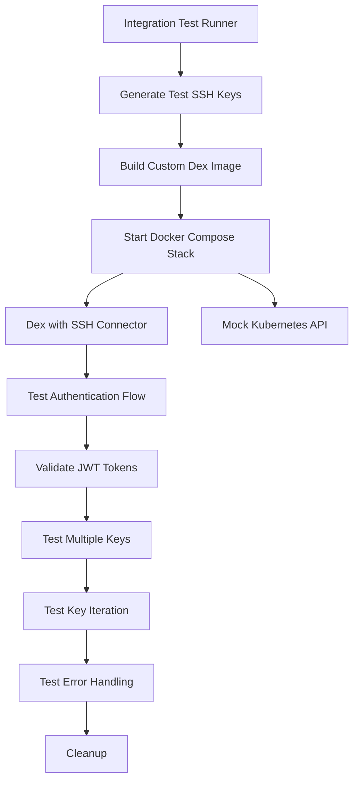

# kubectl-ssh-oidc Integration Tests

This directory contains end-to-end integration tests that validate the complete authentication flow between kubectl-ssh-oidc and a custom Dex instance with SSH connector.

## 🚀 Running Integration Tests

### GitHub Actions (CI)
Integration tests run automatically in GitHub Actions using `hoverkraft-tech/compose-action`:

```yaml
# .github/workflows/ci.yml
- name: Run integration tests
  uses: hoverkraft-tech/compose-action@v2.0.1
  with:
    compose-file: "./test/integration/docker-compose.yml"
```

### Local Development

**Option 1: Full Shell Script (Recommended)**
```bash
make test-integration
```

**Option 2: Quick Go Tests (requires services running)**
```bash
make test-integration-local  # Fast, but requires Docker Compose services to be running
```

**Option 3: Manual Docker Compose**
```bash
cd test/integration
docker-compose up --build -d
INTEGRATION_TEST=true go test -v -timeout 120s ./...
docker-compose down -v
```

## 🏗️ Test Architecture



## 🧪 What Gets Tested

### 1. **SSH Connector Integration**
- ✅ Custom Dex builds successfully with SSH connector
- ✅ SSH connector registers properly in Dex
- ✅ Dex starts and loads SSH connector configuration
- ✅ SSH connector accepts valid SSH-signed JWTs

### 2. **SSH Key Management**
- ✅ Dynamic SSH key generation (ED25519)
- ✅ SSH key fingerprint calculation
- ✅ Multiple SSH keys per user
- ✅ Key discovery and iteration (standard SSH behavior)

### 3. **Authentication Flow**
- ✅ JWT creation with proper claims (sub, aud, exp, jti)
- ✅ SSH signature generation and verification
- ✅ OIDC token exchange with Dex
- ✅ Error handling for unauthorized keys
- ✅ Multi-key fallback behavior

### 4. **Integration Scenarios**
- ✅ **Basic Authentication**: Single key, single user
- ✅ **Multiple Key Support**: User with multiple authorized keys
- ✅ **Key Iteration**: Try unauthorized key, then authorized key
- ✅ **Error Cases**: Completely unauthorized keys fail properly

## 🚀 Running the Tests

### Prerequisites

```bash
# Required tools
docker --version        # Docker for containerization
docker-compose --version # Docker Compose for orchestration  
go version             # Go 1.24+ for building
make --version         # Make for build automation
```

### Quick Start

```bash
# Run all integration tests (recommended)
make test-integration

# Or run components individually:
make build-dex         # Build custom Dex image only
make verify-dex        # Build and verify Dex image  
make clean-integration # Clean up test environment
```

### Manual Execution

```bash
# Navigate to integration test directory
cd test/integration

# Run the test runner directly
./run-integration-tests.sh

# Available options:
./run-integration-tests.sh --help
./run-integration-tests.sh --build    # Build only
./run-integration-tests.sh --verify   # Build and verify
./run-integration-tests.sh --cleanup  # Cleanup only
```

### Environment Variables

```bash
# Test configuration
export TEST_TIMEOUT=600s        # Test timeout (default: 300s)
export INTEGRATION_TEST=true    # Enable integration tests

# Debug options
export DOCKER_BUILDKIT=1        # Use BuildKit for faster builds
export COMPOSE_DOCKER_CLI_BUILD=1 # Use Docker CLI for compose
```

## 📋 Test Components

### Docker Compose Stack

**Services:**
- **`dex`**: Custom Dex v2.39.1 with SSH connector
- **`mock-k8s-api`**: Nginx serving mock Kubernetes API responses

**Networking:**
- Internal Docker network for service communication
- Port mapping: Dex (5556), Mock API (6443)
- Health checks ensure services are ready before testing

### Test Files

```
test/integration/
├── README.md                 # This file
├── docker-compose.yml        # Service orchestration
├── dex-config.yaml          # Dex configuration template  
├── mock-k8s-config.json     # Mock API responses
├── integration_test.go      # Main test suite
└── run-integration-tests.sh # Test runner script
```

### Generated Test Data

During execution, tests create:
- **Temporary SSH keys**: ED25519 key pairs in `/tmp/kubectl-ssh-oidc-integration-*/`
- **Updated Dex config**: Real fingerprints replace placeholders
- **Test binary**: Compiled kubectl-ssh-oidc for testing
- **Container logs**: Available for debugging failures

## 🔍 Test Scenarios in Detail

### Scenario 1: Basic SSH Authentication
```bash
# Test validates:
✅ SSH key generation and fingerprint calculation
✅ Dex configuration with real fingerprints  
✅ JWT creation with username in 'sub' claim
✅ SSH signature of JWT payload
✅ Successful token exchange with Dex
✅ Valid OIDC token returned
```

### Scenario 2: Multiple Key Support
```bash
# Test validates:  
✅ User configured with 2+ SSH keys
✅ Both keys can authenticate successfully
✅ Same user identity returned for both keys
✅ Groups and permissions consistent
```

### Scenario 3: Key Iteration Behavior
```bash
# Test validates:
✅ Standard SSH client behavior (try each key)
✅ First key unauthorized → continues to second key
✅ Second key authorized → authentication succeeds
✅ No early termination on first failure
```

### Scenario 4: Error Handling
```bash
# Test validates:
✅ Unauthorized key returns proper error
✅ Error message includes authentication details
✅ No token returned for invalid authentication
✅ Dex logs show authentication failure
```

## 🐛 Debugging Failed Tests

### Check Container Logs
```bash
# View Dex logs
docker-compose -f test/integration/docker-compose.yml logs dex

# View all service logs
docker-compose -f test/integration/docker-compose.yml logs
```

### Manual Testing
```bash
# Start services manually
cd test/integration
docker-compose up -d

# Check service health
curl http://localhost:5556/dex/.well-known/openid_configuration

# Test with generated keys
export SSH_USE_AGENT=false
export SSH_KEY_PATHS="/tmp/kubectl-ssh-oidc-integration-*/test_key_1"
export KUBECTL_SSH_USER="test-user"
go run ../../cmd/kubectl-ssh-oidc http://localhost:5556/dex kubectl-ssh-oidc
```

### Common Issues

**Docker Build Failures:**
- Ensure Docker BuildKit is available: `export DOCKER_BUILDKIT=1`
- Check Docker has sufficient resources (2GB+ RAM, 10GB+ disk)
- Verify internet connectivity for downloading Dex source

**SSH Key Issues:**  
- Check file permissions: private keys should be 0600
- Verify fingerprint format: should be `SHA256:...`
- Ensure ED25519 keys are supported by Go SSH library

**Network/Port Issues:**
- Check ports 5556, 6443 are available
- Verify Docker network creation permissions
- Try `docker system prune -f` to clean up networks

## 📊 Test Metrics

**Coverage:**
- SSH connector integration: ✅ Complete
- Authentication flows: ✅ Complete  
- Error scenarios: ✅ Complete
- Multi-key support: ✅ Complete

**Performance:**
- Total test time: ~60-120 seconds
- Dex build time: ~30-60 seconds  
- Service startup: ~10-20 seconds
- Authentication tests: ~5-10 seconds

**Reliability:**
- Tests are deterministic and repeatable
- No external dependencies (except Docker Hub)
- Automatic cleanup prevents test pollution
- Comprehensive error reporting

## 🤝 Contributing

To add new integration test scenarios:

1. Add test function to `integration_test.go`
2. Update `TestIntegrationSetup` to run new scenario
3. Document the scenario in this README
4. Test locally with `make test-integration`
5. Verify CI passes with changes

**Example new test:**
```go
func testNewScenario(t *testing.T, testDir string) {
    // Test implementation
}

// Add to TestIntegrationSetup:
t.Run("TestNewScenario", func(t *testing.T) {
    testNewScenario(t, testDir)
})
```